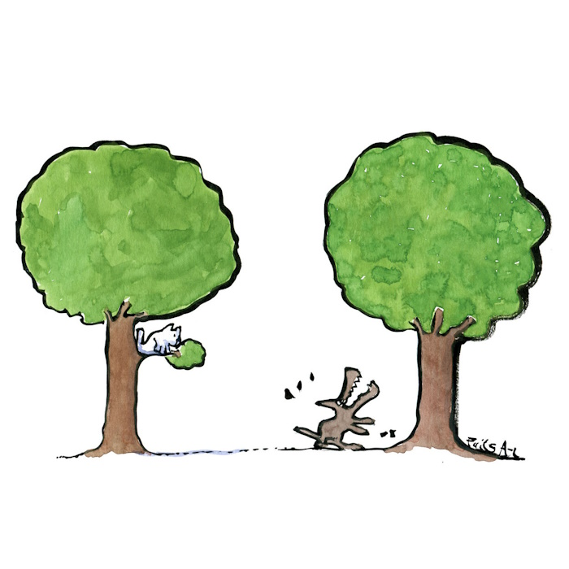
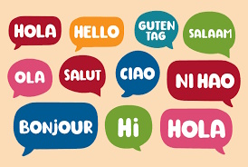

# Class 11. Writing a CV

## Task 1 
### Look at the pictures and name them.

  
  
  
  
  
  
  
  
  
  
  
  


## Task 2
### Discuss the following questions. 

  

1. Have you ever written a CV? Was it easy? Difficult?  
2. What was the most challenging in writing a CV?  
3. Do you think you need to write one CV for all jobs you'll apply for or tailor it to specific jobs?  
4. What are some common mistakes people make when writing CVs?  
5. What parts of the CV do you know? (e.g.education)  
6. How long should be your CV?  
7. Should you state your age in the CV?  
8. If you have a CV, do you think it stands out (is different) from other similar CVs?  
9. Should you include every position you've had in your CV?  
10. Should you state the reason for leaving on your CV?  

## Task 3. Reading 
### A) Read the tips for creating a good resume and compare your ideas from the previous task. 

A resume (also called CV) is a summary of your professional experience tailored for a particular position you're applying for. How can you make sure that your Cv stands out? Follow these 6 tips.  

**KEEP IT RELEVANT TO THE POSITION**  
You shouldn't look at your resume as the list of all jobs you had. You'd rather look at it as a marketing tool to convince a specific company to hire you for a specific job.  

**TAKE OFF ANY UNNECESSARY PERSONAL INFORMATION**  
Some information is just not worth sharing. Your prospective employer does not need to know about your hobbies, age or marital status. However the links to some professional media platforms (GitHub, LinkedIn....) should definitely be included.  

**FOCUS ON ACHIEVEMENTS**  
Too often the job seekers make the mistakes of listing out the job duties they were expected to fulfil instead of describing the value they brought to the company or the project. A good example would be something like: "Boosted the app's accuracy by over 4% by ......"(doing this and this)  

**BE CONCISE**  
It's generally recommended that you keep your CV to one page, no matter how extensive your experience is. Instead of writing long paragraphs use bullet point to outline your skills. 

**LEVERAGE (use) KEYWORDS**  
When you read the job description, pay attention to which words are used the most. Which skills does the job require? Which technologies do you need to be familiar with? Make sure you mention them in your resume.

**FORMAT AND EDIT**  
Proofreading is essential. Make sure your resume is typo-free and your grammar is on-point to eliminate the risk of making a bad impression right out of the gate. 
The visual appeal and readability are important too. Leave enough white space between different sections so that your resume is easy to read.  

### B) Look at the text again and complete the following sentences. 
a) You'd rather look at your resume as a `____` to convince `____`
b) `____` unnecessary personal information.
c) The links to some prefessional media platforms `____`
d) It's recommended that you keep `____`
f) Which technologies do you need to be `____`?
d) Proofreading is `____`
	
## Task 4 Working on examples  
### 4A Resume  

  
  

### 4B Study the resume above and choose the best option.  

> 1. The skills and technologies section in this resume is effective because:  
> - [ ] a. it's short  
> - [ ] b. it's visible and clearly structured  
> - [ ] c. it rates each skill on the scale of 1-10  

> 2. It's good idea to put your education:  
> - [ ] a. at the bottom of your resume  
> - [ ] b. before professional experience  
> - [ ] c. in the most visible part of your resume  

> 3. Your projects section/professional experience section should:  
> - [ ] a. not be included in your resume  
> - [ ] b. contain links to each project  
> - [ ] c. follow a strict chronological order  

> 4. In this resume the author sticks to:  
> - [ ] a. one-column layout  
> - [ ] b. two-column layout  
> - [ ] c. three-column layout  

> 5. The summary of qualifications is affective because:  
> - [ ] a. it uses the first person pronoun  
> - [ ] b. it details the person's education  
> - [ ] c. it is concise  

### 4C Action verbs Complete the following resume with the action verbs from the box below.
  
led    delegated    assumed     interacted     assists    upgraded

###  4D Match the following.

> `release`  
> `on a regular`  
> `assist in`  
> `architected`  
> `maitained code`  
> `actively monitored`  
> `interacted`  
> `coordinated`  
> `globaly`  
> `Major in`  
> new features  
> repositories  
> with clients daily  
> distributed team  
> projects launches  
> services running on AWS  
> basis  
> code for SaaS platform  
> Computer Science  
> developing automation toolsets  


## QA Engineer CV Sample 

  


CV example

This example is a detailed CV for a QA Engineer:

Ethan Wilson
ethan@wilson.com
• (100) 947-1603
• linkedin.com/in/ethan-wilson
• @ethan.wilson

**QA Engineer**
Highly skilled QA Engineer with 4 years of experience in developing and implementing test automation strategies, resulting in a 50% reduction in manual testing time and a 30% increase in test coverage. Proven track record in collaborating with development teams to identify and resolve critical bugs, resulting in a 25% reduction in customer-reported issues and a 15% improvement in customer satisfaction scores. Exceptional skills in analyzing and reporting on test results, providing valuable insights to the product team and contributing to a 20% increase in product quality.

**WORK EXPERIENCE**  
QA Engineer  
03/2022 – Present  
TechTest Solutions  

- Developed and implemented a test automation strategy, resulting in a 50% reduction in manual testing time and a 30% increase in test coverage.
- Collaborated with the development team to identify and resolve critical bugs, resulting in a 25% reduction in customer-reported issues and a 15% improvement in customer satisfaction scores.
- Analyzed and reported on test results, providing valuable insights to the product team and contributing to a 20% increase in product quality.

Test Environment Manager  
03/2020 – 03/2022  
Innovatech Solutions  

- Managed the development and maintenance of test environments, ensuring accurate and efficient testing of software applications and reducing testing time by 20%.
- Identified and documented critical bugs and other issues, leading to a 10% reduction in production issues and a 5% improvement in overall software quality.
- Participated in code reviews, providing valuable feedback to the development team and contributing to a 15% increase in code quality.


Software QA Tester  
03/2019 – 03/2020  
CyberTech Innovations  

- Developed and maintained test plans and test cases for a complex software application, resulting in a 20% reduction in testing time and a 10% increase in test coverage.
- Investigated and troubleshooted customer issues, providing timely and effective solutions and contributing to a 15% improvement in customer satisfaction scores.
- Monitored and reported on quality metrics, providing valuable insights to the product team and contributing to a 10% increase in product quality.


**SKILLS & COMPETENCIES**  

- Test automation
- Test planning and execution
- Test case development and maintenance
- Bug identification and documentation
- Test environment management
- Code review and feedback
- Quality metrics analysis and reporting
- Troubleshooting and problem-solving
- Cross-functional collaboration
- Customer issue resolution
- Continuous improvement
- Agile methodologies
- Performance testing
- Security testing
- Usability testing


**COURSES / CERTIFICATIONS**  
Certified Software Quality Engineer (CSQE)  
04/2023  
American Society for Quality (ASQ)  
ISTQB Certified Tester  
04/2022  
International Software Testing Qualifications Board  
International Software Testing Qualifications Board Agile Tester Extension (ISTQB-CTFL-AT)  
04/2021  
International Software Testing Qualifications Board (ISTQB)  

**EDUCATION**  
Bachelor of Science in Computer Engineering  
2013-2017  
Rochester Institute of Technology, Rochester, NY  
Software Quality Assurance Engineering  
Computer Science  


## Task 5. Your skills 
### Brainstorm your own skills and experiences that are relevant to the job you're looking for/ or have.  
```
...
```

## Task 6. Write your own CV 
Write your CV here.
Please include your Summary of Qualifications, Skills and Tech, Professional Experience, Education. Use the vocabulary from the lesson. Stick to your planned layout. Don't forget to proofread it. 

```
...
```

# 📕 Home assignment 11

## Task 1. CV 

Task 6 from Lesson tasks. 
```
...
```

## Task 2   
### Fill in the gaps with the correct words from the list.


- keywords
- tailored
- quantifiable
- action verbs
- reverse chronological

Your CV should be to `____` the specific job you are applying for. 
Use `____` from the job description to highlight your relevant skills. 
Use `____` to describe your achievements and include `____` results whenever possible.
Organize your experience in `____` order.


## Task 3   
### Give the definitions of the following words. Correct answers are NOT given.
1. concise
```
...
```
2. layout
```
...
```
3. to assist
```
...
```
4. to delegate 
```
...
```
5. to lead 
```
...
```
6. to upgrade 
```
...
```
7. to assume role
```
...
```
8. currently
```
...
```
9. to attract users
```
...
```
