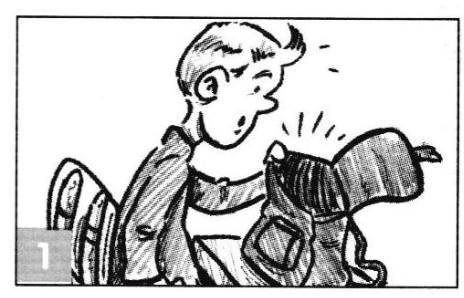
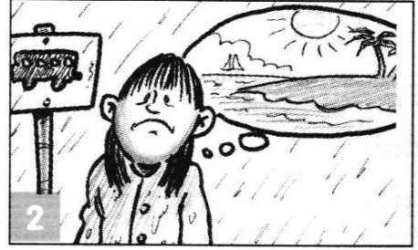
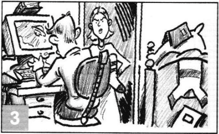
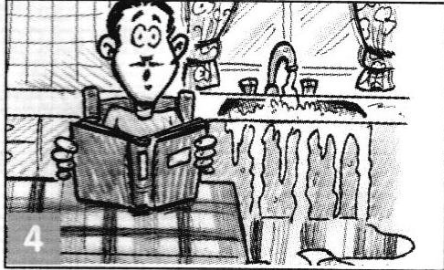
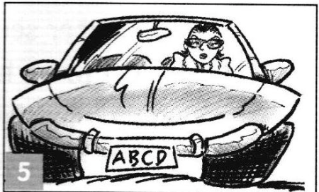
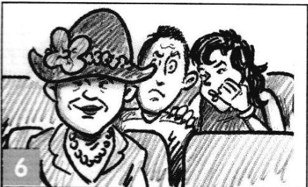

# Class 21. Water travel 2
Practice Gerund/Infinitive more.

## Task 1. Speaking
`Answer the questions. Use full sentences.` 

What do you enjoy doing in your free time?  
> I enjoy watching movies and learning new things, especially about technologe and programming. In my free time, I also like going for walks and spending time with my family.  

Do you mind talking to strangers while travelling on the train bus?  
> I don’t mind talking to strangers while traveling on the train or bus, but it depends on the situation. If the conversation is interesting and friendly, I enjoy it. However, sometimes I prefer to relax or focus on something else, like reading or listening to music.

Why did you decide to study Engling?  
> I decided to study English because it is an important international language. It helps me in my work, travel, and learning new things.  

Is there an event you expect to visit?  
> At the moment, I don’t have any specific events planned, but I am always interested in tech conferences and professional meetups.  

What are you looking forward to doing this weekend? / Tomorrow?  
> This weekend, I’m looking forward to relaxing and spending time with my family. Tomorrow, I plan to focus on work and learning English.  

Would you like to live abroad? Where?  
> I haven't decided yet, but if I were to live abroad, I would choose a country with good opportunities for work and a comfortable lifestyle, like Canada or Germany.  

Whad did your mom/dad/granny make you do at home when you were a kid?  
> When I was a kid, my parents made me clean my room, do my homework, and help with household chores like washing the dishes.

What did you manage to do at work yesterday? Last week?  
> Yesterday, I managed to complete my tasks and solve some technical issues. Last week, I successfully configured some systems and provided support for corporate platforms.  

What does your English teacher name you do at the lessons? Give examples.  
> My English teacher makes me practice speaking, write sentences, and correct mistakes. For example, I answer questions in full sentences and translate phrases from Ukrainian into English.  

---

## Task 2. GERUND/INFINITIVE. Difference in meaning 
`Have a look a those pictures. Discuss them with your partner. Do you see the difference?`

**remember**  

| Infinitive | -ing form |
| --- | --- |
| remember smth, then do it | do smth and remember it later |
| *Please, remember <u>to get</u> my faforite cheesecake* | *I remember <u>eating</u> the best cheesecake in that little cafe in NY* | 

**stop**

| Infinitive | -ing form |
| --- | --- |
| stop smth in order to do smth else | no longer do smth |
| *We've been driving since 8 am. Let's stop <u>to eat</u> a hamburger.* | *In order to lose weight I stopped <u>eating</u> after 6. And it actually helps.* | 

**try**  

| Infinitive | -ing form |
| --- | --- |
| make an effort to do smth difficult (do one's best) | do smth and see what happens (experiment) |
| *I've been trying <u>to lose</u> weight for ages but I can't do it.* | *You think that you're a bit overweight? Tyr <u>going</u> on a diet.* | 

**forget**  

| Infinitive | -ing form |
| --- | --- |
| forget about smth, so you don't do it | do wmth and (not) forget it later |
| *Sorry, I forgot <u>to call</u> you, Mom!* | *I'll never forget <u>talking</u> to my husband's Moom for the first time. It was awful.* | 

---

## Task 3

`Fill in the gaps.`

She stopped `reading` the book because it was getting late.  
I remember `meeting` him at a party last year.  
Try `doing` it on your own to save money.  
He stopped `smoking` to improve his health.  
Remember `to meet` them at the airport. They arrive tomorrow.  
He had more than enough time, so he stopped `to smoke`.  
It is difficult, but try `to do` it.  
The hikers stopped `to take` pictures of the beautiful scenery.  
She can't stop `laughing` at funny jokes.  
He tried `to fix` the broken chair, but it was beyond repair.  
Try `fixing` it instead of buying a new one every time.  

---

## Task 4
`Tick the sentences that you think are incorrect. Correct them.` 

1. She stopped to smoke because she felt tired.   
`She stopped smoking because she felt tired.`  

2. I remember to meet him at the office last year.  
`I remember meeting him at the office last year.` 

3. Don’t forget switching off the light  when you leave the house.  
`Don't forget to switch off hte light when you leave the house.`  

4. He tried eating spicy food, but it made him feel sick.   
`✔️`

5. I’ll never forget meeting the President for the first time.  
`✔️`

6. She stopped working on her project to answer the phone.  
`✔️`

7. He tried to open the jar, but it was too tight.  
`✔️`

8. She forgot bringing her phone to the meeting.  
`She forgot to bring her phone to the meeting.`

---

## Task 5
`Look at the photos and complete the sentences. Correct answers are NOT given.`  

1.   
Oh no! I forgot to pack my lunch.  
> Oh no! I forgot __.    

2.   
I remember __ on holiday.  
> I remember resting on holiday.

3.   
I tried __ my room, but I couldn't find it.  
> I tried looking for it in my room, but I couldn't find it.  

4.   
Did you remember __ the tap off?  
> Did you remember to turn the tap off?  

5.   
Your idea  
> She tried to park the car carefully.  

6.   
Your idea  
> the couple whispered to each other.  

7.   
Your idea  
> She couldn't stop smoking the cigarette.  

8.   
Your idea  
> He struggled to eat the dish, fighting back his emotions.  

9.   
Your idea  
> She tried to work, but endless phone calls kept distracting her.  

---

## Task 6
`Look at the following problems. Take turns with your partner to read them. Give advice to your partner using the verbs below the problem.`

A friendly alien lands in your room at night  
**TRY**  
> Try offering them something to eat, probably something sweet.  

After trying to doze off you gave up.  
**STOP** 
> Stop worrying and try relaxing your mind; it might help you fall asleep.  

You discover you can control the weather with your mood  
**TRY**  
> Try staying calm and positive to keep the weather pleasant.  

You wake up one morning and realize you can only speak in animal sounds.  
**REMEMBER**
> Remember to stay calm and use gestures to communicate while you figure out what’s happening.

You accidentally time-travel to the Middle Ages with just your phone, but there's no Wi-Fi! How will you convince people you’re from the future?  
**TRY**  
> Try showing them the flashlight or taking pictures with your phone to prove it's a futuristic device.

Imagine you’re interviewing for your dream job, but everything goes wrong: your alarm doesn’t go off, you spill coffee on your shirt, and you forget to bring your resume.  
**REMEMBER/STOP**  

You’re shipwrecked on a deserted island, but you have a talking parrot as your only friend.  
**REMEMBER**  
> Remember to stay calm and focus on making a good impression with your skills and confidence. Stop worrying about the mistakes and apologize sincerely for any inconvenience.

You post a silly dance video online, and suddenly, you’re famous worldwide.  
**REMEMBER**  
> Remember to stay true to yourself and enjoy the moment without letting fame change you.

You’re asked to give an important presentation with only 10 minutes to prepare.  
**TRY**  
> Try to stay calm, focus on the key points, and speak with confidence.

---

## Task 7. Speaking 

`Finish the sentence with your idea and give your suggestion.  Please ask your partner follow-up questions.`

Someone famous you would like `to meet one day`.  
A song you love `listening to when you're happy`.  
Another language you want `to learn in the future`.  
A book you didn't finish `because it was too boring`.  
A place in your city you avoid `because of traffic`.  
Something you can't imagine `living without`.  
What you expect `to achieve this year`.  
A job you hope `to get` in the future
Something you enjoy `doing in your free time`.  
A bad habit you stopped `doing last year`.  
A sport you tried `but didn't enjoy`  .
A time when you stopped `to` rest on a journey.  
Someone who told you to remember `an important lesson in life`.  
A time when you tried `to open` the door, but it was locked.  
A time whn the police officer stopped you `for a routine check`.  
A book you remember `reading` in you childhood.  
Next year you hope `to travel somewhere new`.  
When you're on your own, you enjoy `reading or listening to music`.

---

# 📕 Home assignment 21

## Task 1
`Look at the sentences in the table and explain the difference in a written form.`  

> Example:  
> <u>Stop + gerund</u>: She stopped <u>talking</u> when the teacher entered the room.  
> *(She was talking, but then she stopped.)*  

STOP 
- She stopped <u>talking</u> when the teacher entered the room.
- She stopped <u>to talk</u> to her friend for a moment.
> 

TRY
- He tried <u>eating</u> less sugar to improve his health.
- I’ll try <u>to finish</u> my homework assignment before dinner.  

REMEMBER
- I remember <u>meeting</u> him at the party last year.
- Remember <u>to lock</u> the door before you leave.

FORGET
- I'll never forget <u>visiting</u> Paris for the first time.
- She forgot <u>to bring</u> her keys, so she couldn’t enter the house.

> She stopped talking when the teacher entered the room.  
> (She was talking, but then she stopped.)  
> Stop + gerund  
> 
> She stopped to talk to her friend for a moment.  
> (She paused what she was doing to start a conversation.)  
> Stop + to-infinitive  
> 
> He tried eating less sugar to improve his health.  
> (He experimented with eating less sugar to see if it helped.)  
> Try + gerund  
> 
> I’ll try to finish my homework assignment before dinner.  
> I will attempt to complete my homework.  
> Try + to-infinitive  
> 
> I remember meeting him at the party last year.  
> (I have a memory of meeting him.)  
> Remember + gerund  
> 
> Remember to lock the door before you leave.  
> (Don’t forget to lock the door.)  
> Remember + to-infinitive  

---

## Task 2
`Difference in meaning.  Correct the mistakes. Some sentences are correct.`  

1. I remember `reading` that newspaper last summer.  
2. He tried `to surf` despite the rough waves.  
3. They stopped `playing` basketball when the storm started.  
4. Stop `interrupting` others when they speak.  
5. We remembered `visiting` that historic castle years ago.  
6. He stopped `watching` TV late at night to get more sleep.  
7. I know it's difficult, but try `cooking` something special for your anniversary.  
8. He remembered `visiting` London during their honeymoon in 2021.  
9. Try `speaking` slowly so I can understand you.  
10. They stopped `driving`  when the car ran out of gas.  

---

## Task 3

The students hope `to pass` the exam.  
I am always happy `to help` you.    
`Cooking` is one of my hobbies.  
Could you ask her `to copy` this letter for me?
They suggested `going` for a drink.  
I am very interested in `learning` French.  
`Smoking` is bad for your health.  
She managed `to repair` her bike.  
I don't recommend `taking` the bus - it takes forever!  
We have invited Mary `to come` to dinner on Sunday.  

## Extra practice. Video

`Watch the video and learn more.`

[How to use GERUNDS and INFINITIVES | Confusing English Grammar](https://www.youtube.com/watch?v=v2_Qic03XFI)