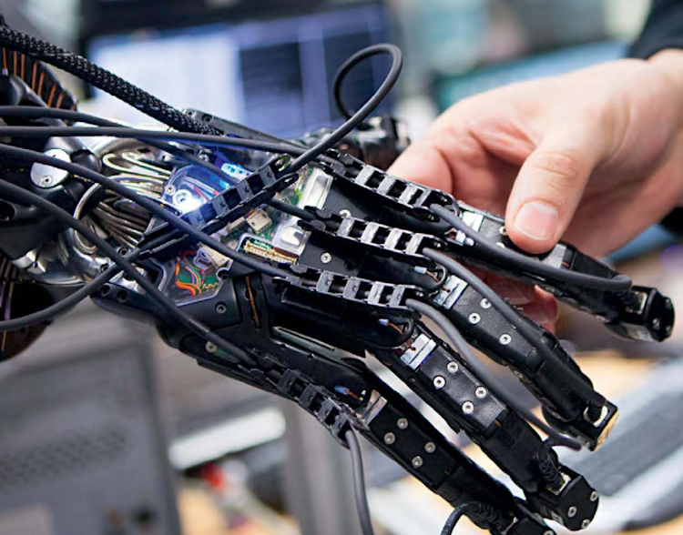
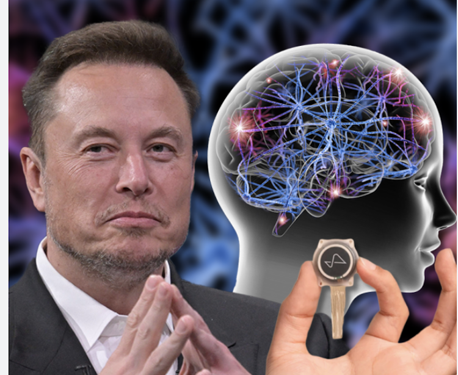
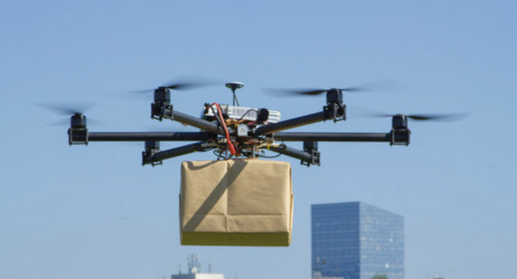
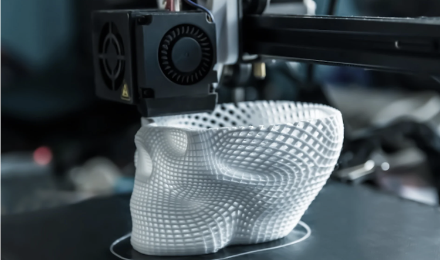

# Class 23. Tomorrow's world 
```
Make predictions about the future.
```

## Review of Future Forms 
```
Write the replies using FUTURE FORMS.
```


1. - Have you made plans for the summer?
   - `Yes, we are going to visit our friends in Germany.`

2. - We're moving house tomorrow.
   - `It's going to be stressful. I will help you with the packing.`

3. - Do you need this paintbrush?
   -  `Yes, I'm going to use it to paint the walls.`

4. - John is a better player than Martin, isn't he?
   - `Yes, I think he will win the next match.`

5. - The weather has been terrible, hasn't it?
   - `Yeah, look at the sky, it’s going to rain soon.`

6.  - Are you meeting your friends next week?
	- `Yes, I'm going to drink some beer with them.`

7.  - What time does the train leave?
	- `It leaves the station at 17:30.`

8. 	- Oh, I don't have Tetyana's phone number.
	- `Don't worry, I will send it to you.`  

9.	- What are you going to do after the class?
	- `I'm going to the cinema with my family`.

---

## Task 1. Discuss
```
Look at the photos and answer the questions.

1 What inventions or developments do the pictures show?
2 How do you think they can benefit people?
```



> The picture shows a bionic hand, an advanced prosthetic that mimics human hand movements. It helps amputees regain functionality and can be used in medicine, robotics, and other fields.



> The picture shows a brain-computer interface, likely from Neuralink. It can help disabled people regain abilities and may enhance human intelligence.



> The picture shows a delivery drone, an autonomous flying device used for fast deliveries. It can reduce delivery time and costs, making shopping more convenient.



> The picture shows a 3D printer creating a complex object. This technology is used in manufacturing, medicine, and design to quickly produce customized items.

## Task 2. Reading
### Task 2A
```
Read the article and sum up each paragraph with 1 sentence. 
```

**Communication**  
In the near future, we may ne able to communicate in any language we choose. A number of companies are working on translating machines that use the voice frequencies of the speaker. This makes it sound as though the user is speaking the foreign language. We already have translating machines, but they are slow and inaccurate and they sound like robots. In only a year or two this new machine, which will be a headset, could come onto the market and allow us to speak every language under the sun.  

> In the near future, advanced translating headsets will allow real-time, natural-sounding speech translation in any language.

**Entertainment**  
Full immersion virtual reality will be with us in perhaps ten to twenty years' time. We will be able to plant tiny microchips in the brain, allowing a person to experience games, movies, and virtual life as if they are real. As computers interact with the brain, we will have the sensation of touching, seeing, hearing, and smelling virtual objects in virtual worlds. Instead of just watching heroes in movies, signals to the brain will let us feel what our heroes feel, see what they see. Fortunately, if things get too terrifying, we will be able to switch it off with the push of a button!  

> Full immersion virtual reality with brain-connected microchips will enable people to experience movies and games as if they were real.

**Health**  
The future of health is going to be a tale of big and small. Tiny nano monitors will be placed inside our bodies, and these will produce Big Data - enormous amounts of information - that allow is to check our health and help us predict illnesses. Another big development probably won't be ready in the short term, but in the long term there is hope that 3D printers will make copies of body parts such as hearts, livers and kidneys. If it happens, this is likely to save millions of lives. Using 3D Printers, we can already  make copies of plastic and metal objects. The next step is to copy living tissue.  

> Tiny nano monitors and 3D-printed organs will revolutionize healthcare by predicting diseases and creating replacement body parts.

**Global problems**  
In the next thirty years, climate change is going to seriously affect traditional farming. Floods and droughts will disrupt farming patterns that have existed for thousands of years. Because of this, cities will have to start producing food, and vertical farming will become common. Tower blocks and skyscrapers will have gardens built into them. Each floor will grow different plants, fruits and vegetables, and the water will be recycled. Instead of stretching out for miles across the landscape, farmland will now rise hundreds of meters into the air.  

> Climate change will force cities to adopt vertical farming, where skyscrapers will grow food using recycled water.

---

## Task 2B
```
Complete the summary of the article with words from the text.
Use one word in each gap.
```

The writer believes a machine will be able to `translate` our words into different languages. She thinks we'll use monitors in our `bodies`
to check our health, and 3D printers will make perfect `copies` of human organs like the heart. We will entertain ourselves
with virtual reality, as computers learn to interact with the `brain`. The problems caused by `climate` change will mean vertical farming becomes popular.

---

### Task 2C
```
Discuss with your group.
```

1. Which ideas are already coming into life?

> Real-time translation technology is already improving with AI-powered translators like Chat GPT and you can use it on your smartphone. And I think in the future they will be able to speak natural voice of user.
> Today we can use VR headsets which offering immersive gaming and training experiences. It's partial implementation of VR, but I think it's enough. I afraid of brain-connected microchips which will provide to us full immersion buy which have potential security risks.
> 3D printing is already used in medicine for prosthetics and some experimental organ printing, but I think widely using this technology for printing real human organs will come not so fast. There are a bunch of complex problems.
> Vertical farming is being implemented in some cities to grow food in limited urban spaces, and I think it's really good and this idea not such complicated as other.

2. Which ideas don't you like? Why not?

> I don't like the idea of implanting microchips in the brain for entertainment because it might be risky and could lead to privacy concerns.
> Nano monitors inside the body sound helpful but may raise ethical issues about data security and medical control.

3. Which ideas in the article do you like? Can you think of other uses for these inventions?

• I like real-time translation headsets because they can help people travel and communicate more easily.  
🔹 Other use: They could be used for international business meetings or learning new languages.  
• I also like 3D-printed organs because they could save lives.  
🔹 Other use: 3D printing could also create custom prosthetics, simplified spare parts for different devices or even houses for people in need.  
• Vertical farming is a great solution for food production in cities.  
🔹 Other use: This method could also be used in space colonization on Mars or the Moon.  

---

## Task 3. Vocabulary. Time markers. 
```
Read sentences 1-6 from the article and identify the time markers.
```

1. `In the near future`, we may be able to communicate in any language we choose.  
2. `In only a year or two` the machine, which will be a headset, could come onto the market ...  
3. Another big development probably won't be ready `in the short term`,  
4. ... `in the long term` there is hope that 3D printers wil make copies of body parts ...  
5. Full immersion virtual reality wil be with us `in perhaps ten to twenty years'` time.  
6. `In the next thirty years`, climate change is going to seriously affect traditional farming.  

---

## Task 4.
```
Group the following time markers.
```

| **Soon** | **Date or time period**| **In a long time** |
| --- | --- | --- |
| int he near future| in the next 30 years' time| in the long term |
| in the sort term | in perhaps 10 t0 20 yeears | in the long term |
|| in a year or two||

---

## Task 5. Speaking

```
work in pairs. Ask and answer the questions using both the time markers given.
```

1. Will you still live in the same place: `a) in the near future?` `b) in ten years' time?`  
> 🔹 a) In the near future? – Yes, I will probably stay where I am for now.  
> 🔹 b) In ten years' time? – I'm not sure, but I might move to another city or country.  

2. What projects will you work on: `a) in the short term?` `b) in the long term?`  
> 🔹 a) In the short term? – I will focus on improving my skills and working on current software development projects.  
> 🔹 b) In the long term? – I hope to work on AI and neural network projects, as well as advanced automation systems.  

3. Will your working life/life as a student change: `a) in the next five to ten years?` `b) in a year or two?`  
> 🔹 a) In the next five to ten years? – Yes, technology is evolving fast, so my work will likely involve more AI and automation.  
> 🔹 b) In a year or two? – Probably not significantly, but I will continue learning new skills and working on interesting projects.  

---

## Task 6. Grammar. Predictions 

### 6A
```
Read the extracts from the article. Are predictions certain  (C) or possible (P)?
```

| Prediction | Certain | Possible |
| --- | :---: | :---: |
| We <u>may</u> be able to communicate in any language we choose. | ✔️ ||
| In only a year or two, the headset <u>could</u> come onto the market. || ✔️ |
| This <u>is likely</u> to save millions of lives. |✔️||
| Climate change <u>is going to</u> seriously affect traditional farming. |✔️||
| Tower blocks and skyscrapers <u>will</u> have gardens. ||✔️|

---

### 6B
```
Look at the underlined words above. Complete the rules with will, could, to or be.
```

1. Ми використовуємо `will + infinitive` без `to`, щоб робити передбачення про майбутнє.
> *Tower blocks and skyscrapers <u>will have</u> gardens.*  

2. Ми використовуємо `be going to +infinitive` без `to`, щоб робити передбачення, коли є докази в теперішньому часі.
> *Climate change <u>is going to</u> seriously affect traditional farming.*  

3. Ми використовуємо `may` або `could +infinitive` без `to`, щоб сказати, що щось можливе, але не певне.
> *We <u>may be able</u> to communicate in any language we choose.*  
> *In only a year or two, the headset <u>could come</u> onto the market.*  

4. Ми використовуємо `be likely + infinitive` із `to`, щоб сказати, що щось, ймовірно, станеться.
> *This <u>is likely to</u> save millions of lives*  

---

### 6C
```
Make up sentences.
```

Monday / tomorrow  
> Monday will not be tomorrow.   

Team / win  
> The team is going to win.

not come / party  
> They may not come to the party.  

flight / delay / bad weather  
> The flight is likely to be delayed due to bad weather.  

people / online / time  
> People are going to be online all the time.  

---

### 6D. Practice

> Practice [here](https://www.liveworksheets.com/w/en/english-second-language-esl/1703005#google_vignette)

---

### 6E

> Speak about possible events using: will, be likely to, may, could.

1. write an email today  
> I will write an email today.  

2. eat at a restaurant tomorrow  
> I may eat at a restaurant tomorrow.  

3. go shopping at the weekend  
> I'm likely to go shopping at the weekend.  

4. do your homework tonight  
> I will not do my homework tonight.  

5. meet a friend after class
> I will not meet a friend after class.  

6. go to the cinema at the weekend  
> I may go to the cinema at the weekend.  

7. study English tomorrow  
> I'm likely to stydy English tomorrow.  

8. have dinner at home tonight  
> I will have dinner at home tonight.  

9. go on a holiday next month  
> I could go on a holiday next month.  

10. get your hair cut  
> I may get my hair cut.  

11. clean your bedroom tomorrow  
> I am likely to clean my bedroom tomorrow.  

12. play sport this week  
> I will play sport this week.  

13. wake up before 7am tomorrow  
> I may wake up before 7 AM tomorrow.

14. go to bed before 11
> I could go to bed before 11.  

---

# 📕 Home assignment 23

## Task 1.

> Fill in the gaps.

1. In only a year, I `will finish` (finish) my English course, and I `will speak` (speak) more confidently with native speakers.  
2. In 10 years' time, there `may be` (be) many new technologies that we can't even imagine today.  
> `may be` - (на мою думку) тому що напевно говорити про появу суперновітніх технологій не можна - це лише можливість, і навіть дуже суб'єктивна, виключно на думку автора цього твердження  

3. My brother `is going to move` (move) to another country because he has always wanted to live abroad. He says he `is going to apply` (apply) for jobs there soon.  
4. If you keep practicing every day, you `will improve` (improve) your language skills in only a year.  
5. She `is likely to study` (study) at a top university in 10 years' time if she continues to work hard.  
6. We `aren't going to buy` (buy) a new house this year because we’re saving money, but we will `consider` (consider) it in a few years.  
7. I `may start` (start) a new hobby in only a year, as I'm always looking for new activities to try.  
> `may start` - (а не will start) тому що одного дня все може кардинально змінитись і це виключно можливість  

---

## Task 2 
Match the halves.

In only a year, I am likely to travel `to a country I’ve never visited before.`  
If I save enough money, `I will probably buy a new car for our family trips.`  
In just a few months, they will definitely finish `their training program.`  
If he keeps practicing, he is likely to become `one of the best players on the team.`  
She is going to visit my friends `who live in another city.`  
In only six months, she is starting her new job, `as she has already signed the contract.`  
They will not use as much paper in the future `because more people are switching to digital formats.`  
In 10 years' time, people will  use virtual reality for everyday tasks. `use virtual reality for everyday tasks.`  

---

## Task 3. Writing 

Imagine what life will be like in 10 years. Write a short paragraph (5-8 sentences) describing your predictions.

Use these questions to help you:
• How do you think technology will change our daily lives?
• What might happen to the environment or climate?
• How could work, school, or travel be different?
• Do you think people’s lifestyles may change?

Try to use phrases like `will`, `could`, `may`, and `be likely to` in your writing.  

> If there are no major geopolitical changes, I think that in the next ten years, we may have functional nuclear fusion and strong artificial intelligence. Functional nuclear fusion will be a source of cheap and ecological energy, which humanity desperately needs. Strong artificial intelligence will be a force that drives science, education, and entertainment forward. It may improve everything we know, but it will also lead to significant changes in the job market. I would like humanity to use these achievements for its benefit rather than for selfish goals.