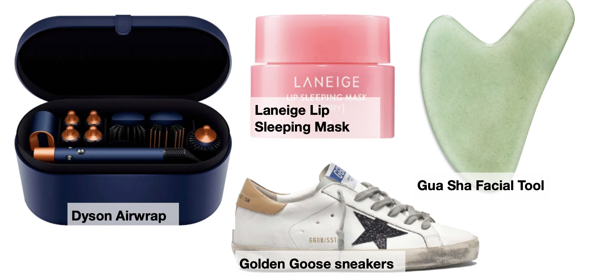

# Class 25. Deinfluencing
[Deinfluence](# "зменшувати вплив, позбавляти впливу") products and explain why they're not [worth](# "вартість, цінність; вартий")
 it.

## Task 1.

Look at the products and discuss the questions:

Video: [$600 for DIRTY Sneakers? Golden Goose Review](https://youtu.be/RhtgCJRR1To)

> Why would someone pay 600 for a dirty pair of [sneakers](# "кросівки")?  
> Like many other brands I review here it was the first time I heard of Golden Goose.  
> After doing some research I got a pair and asked my wife, can you try this one for me?  
> Her first reaction was why would you want me to wear used pair of shoes?  
> I [burst into](# "раптом почати щось, увірватися") laughter totally understanding her reaction because I would have said the same thing.  
> If it was my grandpa [though](# "хоча, проте, однак") he would [be chasing](# "переслідувати, гнатися") me with a stick for spending so much on a [lousy](# "паршивий, жахливий") pair of shoes.  
> After my wife wear these for a few hours she actually said they were really comfortable, and she's not easily impressed.  
> Now, here's [my take](# "моя думка, моя точка зору") on them.  
> At [first glance](# "перший погляд"), the packaging is well done. 
> A little too much for sneakers in my opinion. 
> Overflowing with marketing, in my experience when there's too much marketing you are definitely paying for it.  
> At first look, I think the [leather](# "шкіра (матеріал)") looks pretty good.  
> It's a minimally finished [cowhide](# "коров'яча шкіра") full [grain](# "зерно, текстура, структура") in my opinion before they [harshed it up](# "зіпсував, зробив грубішим").  
> It's a pretty nice leather choice from the first feel, and the engineering the things inside little [towelish](# "схожий на рушник, рушникоподібний") things probably to absorb moisture in your feet, and the [stitch](# "шов, стібок; зшивати") lines.  
> Everything looks pretty good well crafted shoe, but we're gonna see a lot more details once we open this up.  
> From the upward leather, a good pigment finish [came up](# "з'явився, підійшов, виник") very typical for shoes.  
> It's nice leather choice, definitely throughout the [suede](# "замша") accents they're all good, the little other silver color on the [heel](# "п'ята, каблук") is good as well.  
> The similar leather in the top of the inner [sole](# "підошва, єдиний") is also nice.  
> So, leather choice is not bad at all.  
> Very typical but it's not [spectacular](# "вражаючий, захопливий") or extremely special for the price of the shoe.  
> There's quite a bit of [thoughtful](# "задумливий, уважний, турботливий") engineered pieces inside like this towel looking thing probably to absorb the moisture, a lot of sponges to give that cushiony look, and a lot of people in my research mention the comfort of these shoes probably that's one of the biggest points that makes the shoe a little different than others in my opinion.  
> The only part that kind of [disappointed](# "розчарований") me was this sides that looks like leather is not actually leather, it's a PU fake leather material.  
> Probably they made that decision from a [durability](# "міцність, довговічність") [standpoint](# "точка зору, позиція") since this is going to get kicked around, and that might be a more durable material they choose here.  
> [Overall](# "загалом, в цілому"), very well constructed shoe.  
> It was very hard to open, very nice glues engineering internal support materials made with attention to detail, made for comfort, engineered for durability.  
> Definitely I can see that when I'm opening this shoe.  
> Leathers are good as well, it's made in Italy, that's a big plus in my eye as well.  
> But let's be honest $545 is a really high price even for a shoe of this caliber.  
> They managed to catch the attention of [affluent](# "заможний, багатий") customers who set the trends by making something different and expensive and yes if you make something different and lower price it, it's not going to work.  
> If you make something [subtle](# "тонкий, витончений, ледь помітний") and make it expensive it's not going to work again.  
> So this is the perfect formula to catch the attention of [trendsetters](# "законодавці моди, ті, хто задають тренди") and then become a big topic in today's market.  
> It's a delicate dance of offering something special yet overpriced to catch the eye of the trendsetters and this is exactly what's happening with the Golden Goose.  
> Their [rebellious](# "бунтівний, непокірний") philosophy aligns really well with the gen Z era, but I think their marketing takes it a little bit too far.  
> In my opinion, it misses the point because I believe dreaming is freedom and it is a state of being, and you don't need to spend six hundred dollars to wave a flag of it.  
> When I was doing the research about the customer reviews of the brand I found an article where the guy says it's Italian leather it's a lot more expensive than other leathers, and it takes longer to produce.  
> Well, it's wrong. 
> Yes, Italian leathers are usually a bit more expensive than rest of the world, but in a pair of shoes probably difference wouldn't be more than ten dollars, and it doesn't take longer to make unless we're talking about exclusively vegetable [tan](# "засмага; дублення; жовтувато-коричневий колір") specialty letters, and this is not the case here.  
> They're very typical leathers made in Italy, they're definitely good quality on a well-constructed shoe.  
> But, the [perception](# "сприйняття, усвідомлення") of that expensiveness and taking longer parts coming from the exactly overpricing strategy of the brand because when you price something high people think everything you use is special expensive and takes longer to produce.  
> Finally, it is a nice trendy piece of shoes.    
> Does it worth the price tag for a person like me who doesn't care about trends?  
> Not really, but if you're into it why not?

• Do you trust bloggers and influencers when they promote products? Why? Who do you trust?

> I don’t always trust bloggers and influencers when they promote products because they are often paid for advertisements. However, I trust those who give honest reviews and share both pros and cons.

• Have you ever bought a product under the influence of a blogger? What were your expectations? What was the reality?

> No, I don’t fall under their influence, but they can interest me in a product. After that, I search for specific information about it and decide whether to buy it or not, and whether to choose this product or an alternative.

• Do you think the products below are worth their money? Whay makes them so popular?

> Personally, I am not familiar with these products, but I think that, although they are high-quality, they are overly advertised, and a huge part of their cost is paid by consumers solely for the brand and marketing.

---

## Task 2. Video

### Task 1. Watch the video and write the products that are deinfluenced in this video.

"Deinfluencing" means [convincing](# "переконливий") someone not to do or buy something. It's like telling them why they shouldn't do it. You give them reasons to change their mind and avoid making a mistake or something bad.

Watch the video [here](https://drive.google.com/file/d/1W1hdIExSOwtIJM4Lq1lGNIJ86XVvn67E/view)

> <u>Florence, Italy version</u>  
> this is gonna be slightly controversial but that's okay  
> it is about this place right here that you probably seen all over your feed  
> it's called "All  Antico Vinalo"  
> all those people are waiting for this  
> now this place is super famous  
> so by all means if you wanna go eat there, live your dreams!  
> live your dreams!  
> but I personaly feel that it is WAYYY overhyped  
> it is double the price of other panini cost if Florence  
> The wait time is like insanely long  
> for what my opinion is just an okay pinino  
> this is just a personal thing  
> but ever single time I've been in there they've been like not nice  
> And we like nice people here  
>   
> - Pino's Sandwiches  
> - I Fratellini  
> - Panini Toscani  
> - Da Vinattieri  
> - SandwiChic  
> - Officina dei Sapori  
>   
> HERE is where I would go in Florence instead  
> to get an authentic panino that is half the price, with  
> kinder people, and thay you don't need to wait 1.5 hours in line for  
> AGAIN - if you want to go to  
> All'Antico Vinaio, by all means go for it!  
> I just personally feel that  
> there are better places in   
> Florence to get a panino  
>
> <u>Overhyped overpriced products Pt. 2!</u>
> overhyped overpriced products and what you should byu instead part 2  
> courtesy of me Vivian  
> your rich BFF and your favorite Wall Street girly  
> Some people are gonna be mad but Dyson hair tools  
> people swear by these  
> influencers love them  
> and clearly I bought them  
> and I'm not saying they don't work they do  
> but at $400 to $600  
> you can accomplish the save thing with much more affordable tools  
> and frankly if you don't know how to do your own hair  
> buying an expensive tool isn't gonna suddenly turn you into Jonathan Van Ness  
> like I thought it would  
> I thought that buying a fancy blow dryer would give me the perfect blowout  
> but I still don't know how to use a round brush  
> and I am unskilled  
>
> <u>#deinfluencing skincare edition</u>
>
> <u>de-influencing dior:</u>

### Task 2. Watch the video again and answer the questions. 

1. What are the reasons why All’ antico Vinaio is overhyped?
2. Why does the speaker deinfluence Dyson hair tools?
3. What expectation the speaker had about Dyson that didn’t live up to the reality?
4. Why does the speaker 3 doesn’t like the products she’s talking about?
5. Is everything in Dior products bad?

> 1. All’ Antico Vinaio?  
> It's twice as expensive as other panini in Florence; the waiting time is extremely long and the staff was not friendly every time the speaker visited.  
>   
> 2. Dyson hair tools?  
> Hairdryers are overpriced ($400–600); cheaper alternatives provide the same results.
>   
> 3. Expectation about Dyson ha?
> An expensive tool won’t magically improve your hairstyling skills and reviewer still don't know how to use a round brush properly.
>
> 4. Skincare products  
> They are so many better other products on the market, and comparable alternatives are available at lower prices. This products are are overpriced and overhyped.  
>   
> 5. Dior products?  
>  This products have high price and low quality.  

---

Task 3. Vocabulary 1

Complete the sentences with the pairs of words from the box.

Brainstorm products these sentences might describe.

`overpriced` `buzz` `totally` `do` `hype` `buck` `worth` `okay` `disappointment` `rave` `wallet` `rip-off`

1. I bought it, but honestly, it's `overpriced` and it's not amazing, I regret buying it. It's not worth the `buzz`.
2. People keep saying this product deserves all the `hype`, but honestly, it didn't `do` anything for me.  
3. That new product everyone's talking about is `totally` overhyped. It's not `worth` the crazy price they're asking for.  
4. I tried this new place, but honestly, it was just an `okay` panini. Nothing to `rave` about, you know?  
5. That new smartphone might look cook, but it's a total `rip-off` it's such a `disappointment` to be honest.  
6. Trust me, if you don't buy this gadget, your `wallet`  will thank you. Save a `buck` and go for a more affordable alternative that works just well.  

---

# Task 4. Activating vocabulary 
Complete the gaps and answer the questions.

| En | Ua | Path of speech | 
|---|---|---|
| `deinfluence`   діінфлуенс | зменшувати вплив, позбавляти впливу | verb |
| `worth`   ворθ | вартість, цінність; вартий | noun, adjective |
| ░░░░░ Task 1  ░░░░░ | ░░░░░░░░░░░░░░░░░░░░ | ░░░░░░░░░░ |
| `sneaker`   снікер | кросівка | noun |
| `burst into`   берст інту | раптом почати щось, увірватися | phrasal verb |
| `though`   зоу | хоча, проте, однак | conjunction, adverb |
| `chase`   чейс | переслідувати, гнатися | verb |
| `lousy`   лаузі | паршивий, жахливий | adjective |
| `take`   тейк | думка, точка зору | noun |
| `glance`   гланс | погляд | noun |
| `leather`   ледер | шкіра (матеріал) | noun |
| `cowhide`   каухайд | коров'яча шкіра | noun |
| `grain`   грейн | зерно, текстура, структура | noun |
| `harsh up`   харш ап | псувати, робити грубішим | phrasal verb |
| `towelish`   тауліш | схожий на рушник, рушникоподібний | adjective |
| `stitch`   стіч | шов, стібок; зшивати | noun, verb |
| `come up`   кам ап | з'являтися, підходити, виникати | phrasal verb |
| `suede`   суейд | замша | noun |
| `heel`   хіл | п'ята, каблук | noun |
| `sole`   соул | підошва, єдиний | noun, adjective |
| `spectacular`   спектак’юлер | вражаючий, захопливий | adjective |
| `thoughtful`   θотфул | задумливий, уважний, турботливий | adjective |
| `disappointed`   дисапойнтед | розчарований | adjective |
| `durability`   д'юрабіліті | міцність, довговічність | noun |
| `standpoint`   стендпойнт | точка зору, позиція | noun |
| `overall`   оуверал | загалом, в цілому | adverb, adjective |
| `affluent`   афлуент | заможний, багатий | adjective |
| `subtle`   сабтл | тонкий, витончений, ледь помітний | adjective |
| `trendsetter`   трендсеттер | законодавець моди, той, хто задає тренди | noun |
| `rebellious`   ребеліес | бунтівний, непокірний | adjective |
| `tan`   тен | засмага; дублення; жовтувато-коричневий колір | noun, adjective, verb |
| `perception`   персепшн | сприйняття, усвідомлення | noun |
| ░░░░░ Task 2  ░░░░░ | ░░░░░░░░░░░░░░░░░░░░ | ░░░░░░░░░░ |
| `convincing`   конвінсінг | переконливий | adjective |

