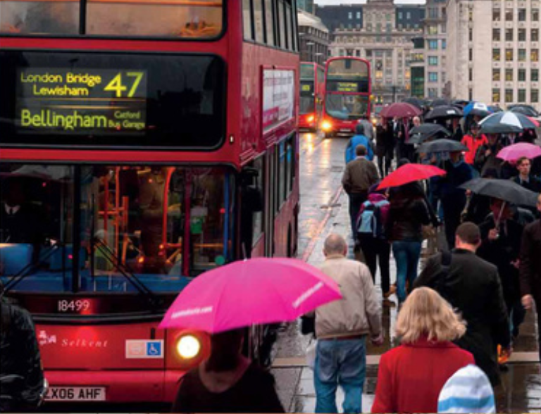

# Class 28. Quality of life
Use "I wish" patterns correctly. 

# Task 1. Vocabulary review 
*Complete the questions with missing words. Then discuss them.*

1). Have you ever bought something that you thought was a /ˈrɪp ˌɒf/ `rip-off`? What was it, and how did you feel?  
2). Can you think of[🌍](# "think of [θінк ов] — думати про, згадувати") a movie, book, or product that didn’t live up[🌍](# "live up [лів ап] — відповідати (очікуванням), жити згідно з") to the /haɪp/ `hype` ? Why not?  
3). Have you ever done something and later thought, /ɪts nɒt ˈwɜːθ/ `It's not worth` it”? What happened?  
4). Is being /ˈnəʊ.zi/ `nosy` always a bad thing? Why or why not?  
5). What is something that you find a /ˈnjuː.səns/ `nuisance`[🌍](# "nuisance [нюісенс] — неприємність, прикрість, набридлива людина або річ") in your daily life?  
6). What kind of behavior really /ɡets ɒn jɔː(r) nɜːvz/ `gets on your nerves` ?  
7). Do you think leaders today need to /kənˈfɜːm ðeə(r) ˈpaʊə(r)/ `confirm their power` in different ways? Why?  
8). How often do you do /ˈbeɪ.sɪk ˈriː.sɜːtʃ/ `basic research` before buying something expensive?  

---

## Task 2. Discussion
*Look at the photos and discuss the questions.*  

- What are the people doing?
> - **A).** A woman is working late at night on the computer, possibly she is tired.  
> - **B).** A woman is meditating outdoors.  
> - **C).** A homeless person is sitting on the street with a sign and ask for the help.

- What things do you think contribute[🌍](# "contribute [контріб'ют] — робити внесок, сприяти") to the happiness or unhappiness of an individual person, a local community, a country?
> **For an individual person:**  
> - **Happiness**: Love and support from family, good health, financial stability, a sense of purpose, hobbies, and relaxation (like meditation).  
> - **Unhappiness**: Loneliness, stress from work, financial problems, poor health, or homelessness.  
>
> **For a local community:**  
> - **Happiness**: Safety, clean environment, opportunities for work and education, and support for those in need.  
> - **Unhappiness**: High crime rates, poverty, lack of social services, and unemployment.  
>
> **For a country:**  
> - **Happiness**: Economic stability, good healthcare and education, human rights, freedom, and low corruption.  
> - **Unhappiness**: Political instability, economic crises, war, inequality, and lack of opportunities.  

---

## Task 3. Song
*Listen to the song and tell your partner what things make the author happy. Do they make you happy as well?*

[Louis Armstrong - What A Wonderful World (Official Video)](https://youtu.be/rBrd_3VMC3c)

> I see trees of green  
> Red roses too  
> I see them bloom  
> For me and you  
> And I think to myself  
> What a wonderful world  
>   
> I see skies of blue  
> And clouds of white  
> The bright blessed day  
> The dark sacred night  
> And I think to myself  
> What a wonderful world  
>   
> The colors of the rainbow  
> So pretty in the sky  
> Are also on the faces  
> Of people going by  
> I see friends shaking hands  
> Saying, "How do you do?"  
> They're really saying  
> I love you  
>   
> I hear babies cry  
> I watch them grow  
> They'll learn much more  
> Than I'll ever know  
> And I think to myself  
> What a wonderful world  
> Yes, I think to myself  
> What a wonderful world  
> Ooh, yes  

---

##  Task 4. Reading
### 4A 
*Read the article and answer the questions.*

1). What is the Gallup World Poll?  
2). How large is it?  
3). What are five aspects of life that the poll asks about?  
4). What are the main reasons for unhappiness according to the poll?   

**Imagine a ladder with steps numbered from 0 at the bottom to 10 at the top. If the top step of the ladder is the best possible life for you and the bottom of the ladder is the worst possible life for you, what step of the ladder do you think you are on?**

Over recent years, it has often been argued that it would be better to measure a country’s progress not simply in terms of wealth, but by thinking about what an economy should provide: good quality of life and happiness. The Gallup World Poll tries to measure this. The survey is done in over 160 nations and asks around 1,000 people in each country questions such as the one above.

Similar questions are asked about the situation of the country in general and about how those interviewed see their own lives in the past, present and future. The poll also has a wide variety of other questions which explore people’s feelings about life. The questions not only ask about finance, but also cover mental and physical health, how strong people’s local community is, social experiences and people’s purpose in life.

In explaining why they are unhappy with their lives, people do sometimes say they wish they had a higher income[🌍](# "income [інкам] — дохід, прибуток") or that they could afford[🌍](# "afford [афорд] — дозволити собі (фінансово чи в інший спосіб)") a car. However, more often the reasons are not to do with money: mostly people complain[🌍](# "complain [комплейн] — скаржитися, нарікати") about the environment they live in, lack of time with family and friends or anxiety[🌍](# "anxiety [енґзаєті] — тривога, неспокій") and depression. The results of the survey suggest that societies might be better dealing with these reasons for unhappiness rather than only trying to increase wealth[🌍](# "wealth [велθ] — багатство, достаток") and wages[🌍](# "wages [вейджиз] — заробітна плата (погодинна, денна або тижнева)"). The results may also explain why Costa Rica is much happier than richer countries like the US and Singapore.

---

### 4B 
*Choose the best conclusion for the article.*

a). The government shouldn't try to increase wealth.  
b). ✔ It's essential to improve people's environment and reduce working hours and stress levels.  
c). Poorer people are usually happier than rich people.  

---

### 4C. Reflection
*Answer the questions.*

- What's your opinion of the article?
- Have you ever been in a poor country and had the same feeling that people there were much happier? Tell about it to your partner.

---

## Task 5. Grammar: patterns with I WISH
### 5A Listening
*Listen to three people answering different questions from the Gallup Poll. Match speakers 1-3 with questions a-c.*  

1). Speaker 1  
C). Is the government doing enough to protect the environment?  

2). Speaker 2  
B). Are you happy with your job? How could it be better?  

3). Speaker 3  
A). Do you feel you have enough holidays? Free time?  

---

### 5B
*Read the replies 1-3. Do the underlined phrases refer to a present, past or future situation?*  

1). I wish I could work fewer hours.  
2). I wish they would ban cars from the city centre.  
3). I sometimes wish I earned a bit more money.  

`I sometimes wish I earned a bit more money.`    `I wish I could work fewer hours`    `I wish they would ban cars from the city centre.`

**PATTERNS AFTER WISH**  
Use wish to say what you'd like to change, but probably can't change.  
There are common patterns after wish:  

1). Use I wish + <u>PAST SIMPLE</u> to say how you want a present situation TO be different.  
`I sometimes wish I earned a bit more money.`

2). Use I wish + <u>COULD</u> to say what you want to be able to do now.  
`I wish I could work fewer hours`  

3). Use I wish + <u>WOULD</u> I to say what you want someone/ something else to do now or in the future.  
`I wish they would ban cars from the city centre.`

---

### 5C Pronunciation
*Listen and repeat.*  

1). I wish I could swim faster.   
2). I wish I could play the guitar.   
3). I wish I could visit you this weekend.   
4). I wish I could speak French fluently.   
5). I wish I could stay longer.   

---

# ⚠ Unknown words

| En | Ua | Path of speech | 
|---|---|---|
| `think of`   θінк ов | думати про, згадувати | phrasal verb |
| `live up`   лів ап | відповідати (очікуванням), жити згідно з | phrasal verb |
| `nuisance`   нюісенс | неприємність, прикрість, набридлива людина або річ | noun |
| `contribute`   контріб'ют | робити внесок, сприяти | verb |
| `income`   інкам | дохід, прибуток | noun |
| `afford`   афорд | дозволити собі (фінансово чи в інший спосіб) | verb |
| `complain`   комплейн | скаржитися, нарікати | verb |
| `anxiety`   енґзаєті | тривога, неспокій | noun |
| `wealth`   велθ | багатство, достаток | noun |
| `wage`   вейдж | заробітна плата (погодинна, денна або тижнева) | noun |
| `regret`   ріґрет | жаль, прикрість; шкодувати | noun, verb |
| `confidence`   конфіденс | впевненість, довіра | noun |

---

### 5D

> **I Wish...**  
>   
> This presentation will help you learn and practice the "I wish" pattern in English. You will be able to express your desires and regrets[🌍](# "regrets [ріґретс] — жалі, прикрощі") with confidence[🌍](# "confidence [конфіденс] — впевненість, довіра").  

> **I wish I could...**  
>   
> 1). Expressing Wishes    
> The pattern "I wish I could" expresses a wish for a situation or ability that we don't have.    
>   
> 2). Present Tense    
> Use "could" with the base form of the verb, like "could travel".  
>   
> **I wish I could...**  
>   
> *Example 1:* I wish I could travel to another country.  
> *Example 2:* I wish I could ______ all the chocolate I want.  

> *I wish + would...*  
>   
> Future Wishes  
> The pattern "I wish +would" expresses a wish for something to happen in the future.  
>   
> Present Tense  
> Use "would" with the base form of the verb, like "would remember".  

> **I wish + would...**  
>   
> *Example 1*: I wish they would remember to do my homework on time.  
> *Example 2*: I wish he would ________ how to play the guitar.  

> **I wish...**  
>   
> **1). Wishes**  
> The pattern "I wish" with the past simple for a present situation to be different.  
>   
> **2). Past Simple**  
> Use the past simple tense of the verb, like "knew".  

> **I wish...**  
>   
> *Example 1* I wish I knew the answer to this question.  
> *Example 2* I wish I ________ at that party.  

---

## Task 6.
*Fill in the gaps.*  

1). I wish I `could` quit my job.  
2). I really wish people `would` stop complaining about it.   
3). I wish there `were` more people like her.  
4). I wish they `would` do more to support local communities.   
5). I wish I `had` a bit more free time.  
6). I wish `knew` I what to do about it, but I have no idea.   
7). She wishes she `were` better at math in school.  

---

## Task 7.
*Complete the sentences.*  

1). I wish I__________(unnecessary things)  
> I wish I didn't buy unnecessary things.

2). I wish he ___________ ( exercising regularly)  
> I wish he started exercising regularly.  

3). I wish I _____( afford that expensive concert)  
> I wish I could afford that expensive concert.

4). I wish she___________ (eat healthier)  
> I wish she would eat healthier.

5). I wish it______ (not rain so much)   
> I wish it didn't rain so much.

6). I wish I_______( spent more time)   
> I wish I spent more time with my family.

7). He wishes she_________ ( call)    
> He wishes she would call him more often.

---

## Task 8. My wishes
*Write 6 wish sentences about the topics in the box that are true for you. Use the different patterns with I WISH.*

TOPICS: 

- your job  
- money  
- your family  
- your town/city  
- the world  
- English  
- the government  

> I wish I had more free time at work.  
> I wish I could afford to travel more.  
> I wish we spent more time together.  
> I wish there were more green spaces in my city.  
> I wish people would stop polluting the environment. 
> I wish I didn’t make so many grammar mistakes.  
> I wish the government would improve healthcare and education.  

---

# 📕 Home assignment 28

## Task 1. Reading
*Read the text and write true or false.* 

Happiness in the modern world often seems like a hard thing to find. With busy lives and so much screen time, people are feeling more stressed. It sometimes feels like everyone is on a fast track to get somewhere. Work and school demand a lot of our attention, leaving less time to relax or do things we love. People sometimes compare their lives to others on social media, which can make them feel like they are not doing well. This pressure to be perfect can make happiness seem out of reach.

Despite these challenges, people are finding new ways to be happy. Many have started practicing mindfulness and meditation. These practices help people focus on the present and find joy in simple things, like a beautiful sunset or a good meal. Others find happiness by spending time with loved ones, sharing experiences, and creating memories. Being with friends and family can offer support and remind us of what truly matters in life. People are also learning to switch off their devices more often to enjoy real-life interactions and experiences.

Happiness is not about having a perfect life but enjoying the moments we have. It is important to remember that while the modern world comes with its challenges, it also offers many opportunities to find joy. Whether it's through a hobby, time in nature, or a chat with a friend, happiness is within reach if we know where to look. The key is to appreciate what we have and make time for the things and people that bring us joy.

1). Many people feel more relaxed due to their busy lives and screen time.   
> false   

2). Social media comparisons often make people feel successful and happy.  
> false  

3). Practicing mindfulness can help individuals enjoy simple pleasures.  
> true 

4). Spending time with friends and family can provide emotional support.  
> true 

5). Happiness is about having a perfect life without any challenges.  
> false 

6). People are encouraged to disconnect from their devices to enhance real-life experiences.  
> true

---

## Task 2
Write the sentences based on the pictures. In each sentence use I wish patterns. 

1). 
> I wish I could spend more time with my friends.  

2). 
> I wish the buses weren’t so crowded during rush hour.

3). 
> I wish I could remember all irregular verbs easily.  

4). 
> I wish I had more time to enjoy nature.  

5). 
> I wish I could try all the delicious ingredients on this plate.  

6). 
> I wish people would drive more safely on highways.  

7). 
> I wish people would stop throwing trash in the wrong bins.  

---

## Task 3. Video  
### 3A  
*Watch the video and do the tasks.*  

[The Quality of Life - What Matters To You](https://en.islcollective.com/english-esl-video-lessons/listening-comprehension/deep-listening-focus-on-meaning/the-quality-of-life-what-matters-to-you/337205)

1). Schools, Clean air, Wealth[🌍](# "wealth [велθ] — багатство, достаток")  
2). Good education  
3). Health, education 
4). Work life balance  
5). true
6). have no war and be able plan my future

### 3B
*Sum up the main information in the video. Write a paragraph.*   
> The Better Life Index by OECD shows that people's priorities vary by region, age, and gender. Latin Americans value education, North Americans focus on life satisfaction, and Europeans prioritize health and the environment. Safety is key in Asia-Pacific, while Australians worry about work-life balance. Men prioritize income, women value community, and older people focus on health and civic engagement. The index helps governments create better policies based on people's needs.