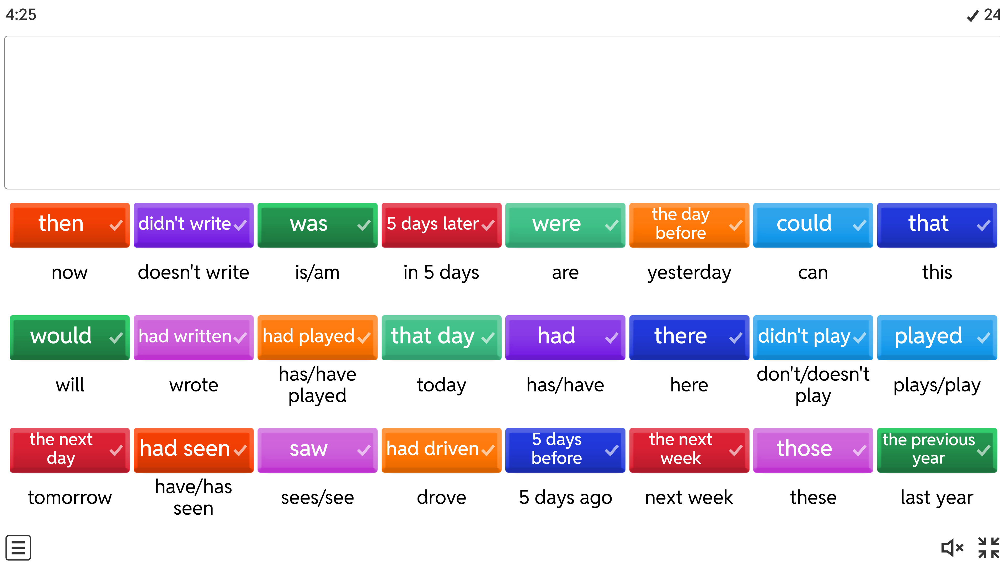

# 📗 Class 29. What did you say?
*Use reported speech correctly.*

## Review of classes 1-5
Find the match.

4). if you   
e). ask me  

2). my views   
k). on  

3). as far as  
i). I'm concerned  

5). to make a  
l). progress  

6). highly-  
b). skilled   

8). semi-detached  
g). house  

7). thatched  
d). cottage  

12). spacious   
h). bedroom  

1). useless  
c). at  

10). less space in   
j). my house than yours  

11). the cheaper...  
a). the easier....  

9). cheaper than  
f). they used to be  

---

### Warm-up. Speaking
*Retell the text you read from your home assignment. Use the table below to help you.*

| Category | Key Words/Phrases |
| --- | --- |
| Challenges to Happiness | Busy lives, screen time, stressed, fast track, work and school, less time, compare lives, social media, pressure to be perfect, happiness out of reach |
| Solutions for Happiness | Mindfulness, meditation, focus on the present, simple things, beautiful sunset, good meal, spending time with loved ones, creating memories, real-life interactions |
| Happiness Defined | Not a perfect life, enjoy the moments, opportunities for joy, hobby, nature, chat with a friend, appreciate what we have |
| Modern World Impact | Challenges, opportunities, balance, switch off devices, enjoy real life |

---

## Task 1. Discussion

Discuss.

- Do you believe people can feel each other's pain or share thoughts without speaking? Why or why not?   
- Have you  heard about mysterious connections between family members or close friends?  

---

## Task 2. Reading and Grammar
### 2A. Prediction
*You're going to read a text about twin sisters and their mysterious connection. Look at the words below and try to predict what the text is going to be about.*   

 `share experience`    `feelings`    `no speaking`     `walk in town`     `her ankle was hurting`  
       `why`     `interesting video`    `send the link`     `was thinking to do the same`

---

### 2B
*Read the text, study the highlighted words and underlined phrases of reported speech.*  

SHARING THE PAIN  
Beth and her twin sister Harriet are convinced that they are able to share experiences and  feelings  without seeing or speaking to each other. Here's what Beth says:  'One day I was walking in town with Harriet. She told me that her right ankle[🌍](# "ankle [анкл] — щиколотка, кісточка (гомілковостопний суглоб)") `was hurting`, but `didn't know` why. She said she `hadn't twisted it` or anything, but told me she `couldn't put` any weight on it. About a minute later, I suddenly felt a sharp pain in my right ankle! On another occasion, I told Harriet that I `had watched` a really good video clip on the Internet the day before. I said that I `would send` her a link to the website where <u>I'd found it</u>. I told her <u>she must watch it</u>. Imagine my surprise when she said she had come across the same clip at the same time. She said that after <u>she'd finished watching it</u>, she had thought about sending me the link.

---

## 2C Reported speech. Grammar table
*Look at the text again. What are the speakers' original words? Complete the table with the correct tenses for the direct speech.*

| DIRECT SPEECH | REPORTED SPEECH |
| --- | --- |
| present simple | past simple |
| present continuous | past continuous |
| past simple | past perfect |
| past perfect | past perfect |
| present perfect | past perfect |
| can/can't | could/coudn't  |
| will/won't | would/wouldn't  |
| must | had to |

Study the rest of the rules.

REPORTED SPEECH
 
a). These verbs do not usually change in reported speech: *might, should, could, would, would like*.  
b). The past perfect does not change in reported speech. *"I'd never been there". She said she'd never been there*.    
c). We always use a personal object with *tell*. With *say*, we do not need a personal object. *I told John that I'd phone. I said (to Jo) that I'd phone*.   
d). We often omit "that" in reported speech. *He said he'd call you.*  

- Work with a partner. Find the examples of rules a-d in the text.

> NOTE!  
> Pronouns, possessive[🌍](# "possessive [позесів] — власницький, присвійний") adjectives and references of time and place usually change in reported speech.  
> "I'll phone you tomorrow", he said to me.  
> "He told me he'd phone me the following day  

| from | to |
| --- | --- |
| now -> | then/at that moment  |
| today ->| that day |
| an hour ago -> | an hour earlier |
| yesterday-> | the day before |
| last Tuesday/month/year-> | the Tuesday/the month/the year before |
| tomorrow-> | the following day |
| next week/month-> | the next week/month;  the following week/month |
| here-> | there |

---

## Task 3. Listening
### Part 1. 
*You are going to hear Nick telling his friend Will about what happened.*

[Reported Speech 1 - B1 - Context Listening](https://youtu.be/E8nfJsvC4cI)

recording 25

> Hi, Will, it's Nick here.  
> Hi.  
> Hey, where were you on Friday night?  
> I'm sorry I didn't meet you.  
> That's why I'm ringing — I had an argument with my mum.  
> What was it about?  
> Well, I didn't have to go to college on Friday, so I asked a few friends around.  
> I hadn't expected Mum to come home early, so when she arrived, she was really angry.  
> Why?  
> Oh, you know, because there were some dirty plates and a few saucepans.  
> Why were you cooking?  
> Yeah, we had some spaghetti.  
> Anyway, she said I couldn't go out because I hadn't tidied the house and I hadn't washed up.  
> That's so unfair!  
> She said she was expecting visitors and that the house was dirty and untidy.  
> Was it?  
> Not really, but she said I had to stay at home.  
> But I did feel a bit guilty, so I said I would wash up.  
> Yeah, and what about the others?  
> She said my friend should help too, but they disappeared by then. All that shouting frightened them, I think.  
> So you washed up?  
> Yeah.  
> But she was still angry. She seems to forget all the things I do to help.  
> So I said that I had washed the car the week before, but that seemed to make her angrier because I forgot that she'd paid me to do that.  
> So what did she say then?  
> She said she was going to keep my pocket money this week.  
> No way! So I can't go out tonight either because I haven't got any money.  
> I can lend you some.  
> I'll see you at the bus stop at eight.  
> Then, great.  
> See you there.  

Answer these questions.

- How did Nick’s mother feel when she got home?  
> Nick said that his mother had been really angry when she got home.  

- What hadn’t Nick done?  
> Nick mentioned that he hadn’t tidied the house or washed up.  

- What did Nick offer to do?  
> Nick explained that he would wash up.  

- What had Nick’s mother paid him to do?  
> Nick stated that his mother had paid him to wash the car.  

- Why can’t Nick go out tonight?  
> Nick reported that he couldn’t go out that night because his mother was keeping his pocket money, so he had no money.  

- What does Will offer to do?  
> Will said that he would lend him some money.  

### Part 2. Listen again if necessary and fill in the gaps.
 

1). She said I couldn’t go out because I ` hadn't ` tidied the house.  
2). She said she ` was expecting ` visitors and the house ` was ` dirty and untidy.  
3). I said I ` would ` wash up.  
4). She said my friends ` should ` help too.  
5). I said I ` had ` washed the car the week before.  
6). She said she ` was ` going to keep my pocket money.  

---

## Task 4. Practice
*Rewrite the sentences in reported speech (Imagine that the speakers were talking to you)*  

1). 'I'll call you when I get back this evening,' said Maisy.  
> Maisy said she would call me when she got back that evening.  

2). 'I might disable data roaming when I go abroad next week', said Joel.  
> Joel said he might disable data roaming when he went abroad the following week.  

3). 'Kelly had never had a real friend', said Max.  
> Max said Kelly had never had a real friend.  

4). 'I haven't topped up my mobile since last month', said Freddy  
> Freddy said he hadn't topped up his mobile since the previous month.

5). 'You mustn't let your battery run out', said my mum.  
> My mum said I mustn't let my battery run out.

6). 'Liam saved your number to his phone book', said Sally.  
>  Sally said Liam had saved my number to his phone book. 

7). 'This time next week I'll be flying to Prague',said Tom.  
> Tom said that time the following week he would be flying to Prague.    

---

## Task 5.
Listen and say what he/she said

[7 Listen and say what he/she said.](https://wordwall.net/resource/65798279/7-listen-and-say-what-he-she-said)

1). I'm going to meet my sister.    
2). The people are really friendly.  
3). I'm thinking about volantiering.  
4). I could play the piano.  
5). I'm not waiting for you.  
6). My dad isn't English.  
7). She doesn't like me.  
8). I have the new tablet.  
9). James is my closest friend.  
10). I don't like tomatoes.  
11). I see the campside.  
12). I don't have a costume.  

---

## Task 6. Speaking and writing
### Part 1. 
*Write the answers to these questions.*

1). Where did you go last summer?  
> I went to...  

2). What are you doing this evening?    
> _

3). Can you write with both hands?  
> _

4). Could you walk before you could talk?  
> _

5). What are you going to do at the weekend?  
> _

6). Have you been to Italy?  
> _

7). What time do you usually get to work?  
> _

Part 2. Work in pairs. Ask the questions above,  note your partner's answers and report the answers to the class.

> _

---

## Task 7. Self-study at home
*Watch the following video about reporting questions and answer the questions:*  

- Do we change the word order in a reported question? If yes, how? (Yes/No and WH questions)  
- Do we need a question mark at the end of a reported question?  
- Should the tense of the question stay the same in reported speech?  
- What word can we use to introduce a reported question?  

[Reported Speech 5- Reporting questions](https://youtu.be/g2C7-nLkZ8I)

Reported speech

Reporting questions

Types of questions

H/W questions
> What is your name?  
> How are you?  
> Where do you live?  
> When will you come?  

Yes/No questions

> Are you ok?  
> Do you love me?  
> Hame you seen hte movie?  

Reporting H/W questions

`Direct question` He asked: "How are you?"  
`Indirect question` He asked me how I was.  

`Direct question` He said: "Wjere dp you live?"  
`Indirect question` He asked me where I lived.  

`Direct question` He said: "When did you call?"  
`Indirect question` He asked me When I had called.  

Reporting Y/N questions

`Direct question` He said: "Are you ok?"  
`Indirect question` He asked me if I was ok.  

`Direct question` He said: "Do you love me?"  
`Indirect question` He asked me whether I loved him.  

`Direct question` He said: "Will you marry me?"  
`Indirect question` He asked me if I would marry him.  

---

# 📕 Home assignment 29

## Task 1
*Drag and drop. Send the screenshot of the finished task to your teacher*

[ Repoted Speech (necessary changes)](https://wordwall.net/resource/54820859/repoted-speech-necessary-changes)

## Task 2.
*Correct the mistakes.*

1. `Jake said me that` → Jake told me that `he loved watching thrillers`.
2. `She told her friend` → She asked her friend `can you lend me some money` → if she could lend her some money.   
3. `The assistant said that` `the patient must take the pills three times` → the patient had to take the pills three times a day.  
4. `The manager said that` `they will start the meeting in five minutes` → they would start the meeting in five minutes.  
5. `He said that` `he is going to finish the project` → he was going to finish the project `yesterday` → the day before  
6. `The teacher said students` → The teacher told the students that `the exam results would be announced` `the following week`  
7. `He said that` `he can't finish the task on time` → he couldn't finish the task on time.  
8. `Mrs Jenkins said that` `the exam will be easy` → the exam would be easy   
9. `My daughter asked me` `when the bus will arrive` → when the bus would arrive   
10. `The detective asked` `if I have seen the robbery` → if I had seen the robbery   

---

## Task 3
*Find 7 famous quotes from films. Report them. Make sure you don't include question forms.*  
*Example*: Terminator said,"I'll be back" → Terminator said it would be back.

1). "May the Force be with you." (Star Wars)  
→ They said that the Force should be with me.  

2). "There's no place like home." (The Wizard of Oz)  
→ Dorothy said that there was no place like home.  

3). "I'm the king of the world!" (Titanic)  
→ Jack said that he was the king of the world.  

4). "Life is like a box of chocolates." (Forrest Gump)  
→ Forrest Gump said that life was like a box of chocolates.  

5). "Houston, we have a problem." (Apollo 13)  
→ They said that they had a problem.  

6). "With great power comes great responsibility." (Spider-Man)  
→ Uncle Ben said that with great power came great responsibility.  

7). "You can't handle the truth!" (A Few Good Men)  
→ He said that I couldn’t handle the truth.  

---

## Task 4. Extra practice 

[Reported Speech](https://wordwall.net/uk/resource/3503792/reported-speech)