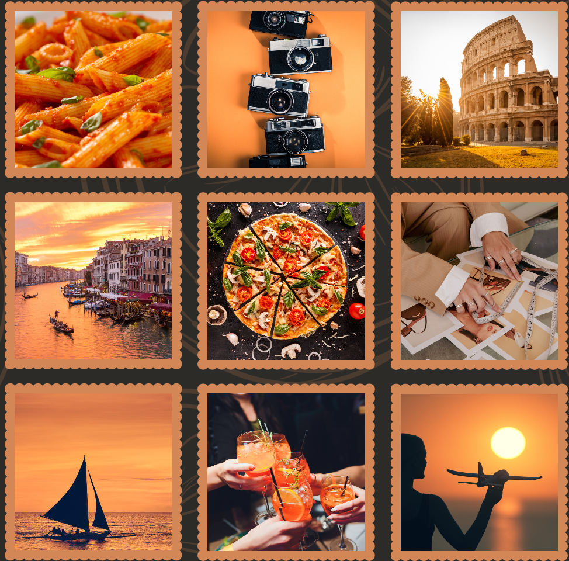
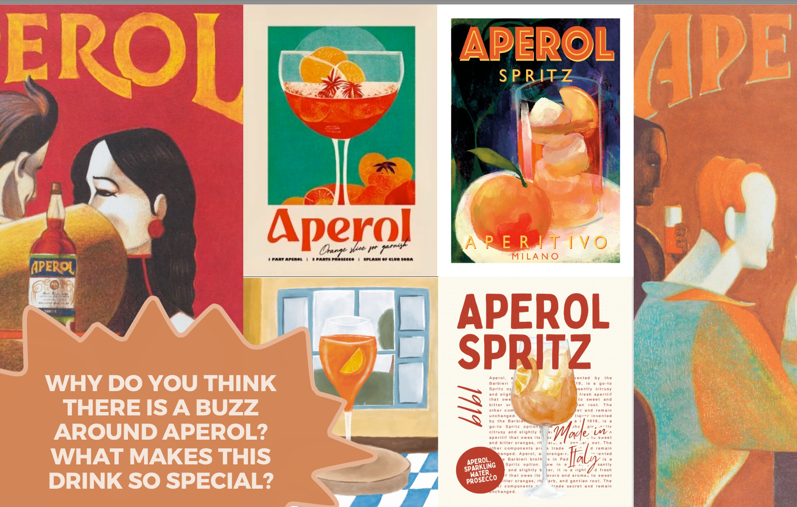
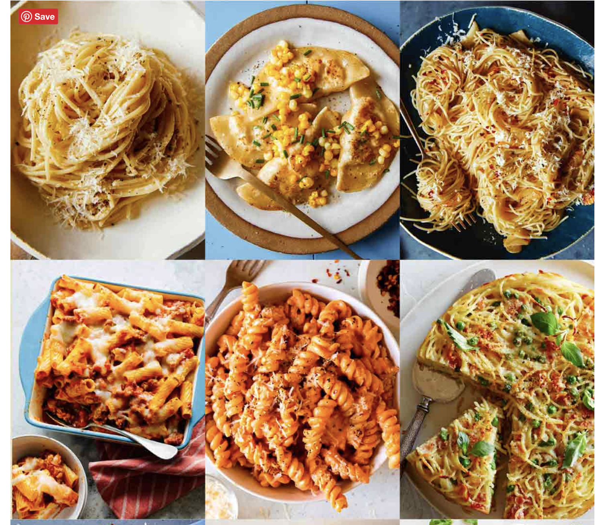

# Class 31. The Aperol phenomenon

*Talk about the history of Aperol Comment using intensifiers*

## Review of reporting verbs (Home assignment)
*Compare your translations and discuss the questions with your group.* 

1). Ви б запросили свекруху піти з вами в кіно?  
> Would you invite your mother-in-law to go to the cinema with you?  

2). Якщо б ваш чоловік/жінка забули помити посуд, ви б нагадали про це?  
> If your husband/wife forgot to do the dishes, would you remind them?  

3). Чи ви колись щось обіцяли, а не виконали?  
> Have you ever promised something but not done it?  

4). Чи ви коли-небуть звинувачували когось в чомусь?  
> Have you ever accused someone of something?  

5). Чи ви зазвичай заперечуєте, якщо зробили помилку?  
> Do you usually deny it if you make a mistake?  

6). Яку б іжу ви ніколи не іли?  
> What food would you never eat?  

---

## Task 1 Discussion
*Watch the video and answer the questions.*

Video is [here](https://www.tiktok.com/@kelseyinlondon/video/7135853061704092933?_r=1&_t=8kogiCy21qv)

1. Have you ever been to Italy? 
2. If not, would you like to go there?
3. What are your associations with Italy?
4. Do you know any stereotypes about Italy/Italians?
5. Have you ever watched an Italian movie or listened to Italian music?
6. If you could visit any Italian city, which one would it be and why?

---

## Task 2. Find someone who
*Look at the pictures and  find out if your partners love these:*

1). loves pasta    
2). enjoys drinking aperol  
3). would like to visit Rome  
4). would like to see the canals  
5). craves for pizza on weekends  
6). is in love with Italian posh brands (Gucci, Prada and Versace)   
7). loves resort cities and the sea  
8). likes to take a lot of photos  
9). enjoys long tours and excursions  
10). loves olives 

---

## Task 3. Aperol 

---

## Task 4 Countries
*What countries drink Aperol the most? Discuss and order the countries from 1 to 6.*

1). Italy  
2). Germany  
3). Austria  
4). The USA  
5). United Kingdom  
6). Spain  

---

## Task 5. Reading
### 5A 
*Lead-in*
Here are the words that people associate with Aperol: 

1). Orange  
2). Italy  
3). Bitter  
4). Refreshing  
5). Summer  

1). Are your associations similar?  
2). What is your favorite drink or cocktail?  
3). Do you think drinks can represent a culture? Why?  

### 5B
*Read the text and answer the questions.*

> This summer, Aperol Spritz has been flowing from the counters of the most wonderful places in New York city. In Paris, it's now a buzz at most cafes next to the local drinks and dishes.  
> Venetian aperitive was recently voted Italy's favourite pre-dinner drink. It is so popular that Italian minister Eugenia Roccella said that this drink is responsible for a population crisis saying that young couples now choose between "Drinking Spritz and having kids".  
> The original Spritz wasn't orange though. Its history goes back to the 18th century when Austria occupied vVenice int 1797  and ruled it for decades; the Austrians had no taste for the heavy Veeenetian wine, Malvasia, and imported their tradition of "Spritzen", adding a splash of sparkling water to a glass of white wine.  
> Aperol was invented in the nearby city of Padova in 1919 by brothers Luigi and Silvio Barbieri after sever years of experiments. It was first advertised in the 1920s to drinkers who wanted to stay fir because of its low alcohol level (11%), and to women in the 1930s with the slogan, "Signora! Aperol keeps you thin".  
> "Aperol Spritz was the drink of the old drunks, the ones at the bar who would say a curse every three words," explained Roberno Pasini, author of the 2013 pamphlet a guide to Spritz.  
> A universal crowd-pleaser, and much less alcoholic than Campari, Aperol introduced a taste for bitterness to people who didn't know they liked it yet, until about 40 years ago, Americans weren't open to bitter flavours. Now, people are googling questions like, "what the heck is vermouth?" or "what is red bitter liquor?", and more existential dilemmas like "can you drink Aperol by yourself?"  

- Do you think the popularity of alcohol can lead to decrease in population?
- Would you like to try the original Aperol that wasn't orange at all?
- Is it possible to be in shape, stay healthy and consume alcohol at the same time?
- What person do you imagine when you hear the word 'Aperol'?
- Do you prefer sweet, sour or bitter tastes?

---

## Task 6. Flexi
*Dive into the world of pasta with this incredible list of the best pasta recipies.
Choose 2 recipies you'd like to try and share with your partner.*  
[The BEST Pasta Recipes](https://www.spoonforkbacon.com/the-best-pasta-recipes/)

---

# 📕 Home assignment 31

## Task 1. Reading
### 1A
*Read the text and translate the following words.*

<u>Discovering Italy: the ideal Country!</u>

There are many destinations in Italy that you must visit once in a lifetime: beautiful places rich in history, art and culture, breathtaking[🌍](# "breathtaking [брейттейкінг] — захоплюючий, вражаючий")  natural landscapes, delicious food and wine will make your trip unforgettable! The Bel Paese offers tourists many attractions[🌍](# "attractions [етрекшнз] — пам’ятки, атракції, цікаві місця") and activities both for singles or couples and for families to relax and have fun in pleasant[🌍](# "pleasant [плезент] — приємний") surroundings in every season. Snow-covered mountains, seaside resorts[🌍](# "resorts [різортс] — курорти"), historical and religious sites, art cities and traditional villages are waiting for you to be discovered. Choose your itinerary[🌍](# "itinerary [ай'тінерері] — маршрут, розклад подорожі") among the many possibilities: Food & Wine, Art & Culture, Nature, Shopping & Markets, Sports and Leisure[🌍](# "leisure [ліжер] — дозвілля, вільний час"), Relax & Wellness[🌍](# "wellness [уелнес] — оздоровлення, хороше самопочуття"), and you will not be disappointed.

Every place has its unique charm, so visit the capital city of Rome with the Colosseum and the Vatican City, Florence with its art-filled streets, Venice with its romantic canals, Verona with the Roman amphitheatre and Juliet’s balcony, Pisa with its characteristic Leaning[🌍](# "leaning [лінінг] — нахил, схильність, уподобання") Tower, Naples and the archaeological site of Pompeii, Siena with its medieval cityscape[🌍](# "cityscape [ситіскейп] — міський пейзаж, панорама міста") and the traditional horse race called Palio, Bologna with its architecture with porticos (corridors) connecting the city and wonderful food, for which it is considered Italy’s food capital and nicknamed la grassa; Milan with its fashion and innovations, Turin with its art galleries and museums like the Automobile Museum.

If you prefer to stay in contact with nature don’t miss the beautiful beaches and the blue sea of Sorrento, Capri and the Amalfi Coast, the unique spectacle of the Frasassi Caves, the ever-popular Marmore Falls, the Lakes of Como and Garda, the three active volcanoes Etna, Stromboli and Vesuvius, the intact[🌍](# "intact [інтакт] — неушкоджений, недоторканий") flora and fauna and the protected mountain of the natural parks in the Dolomites: these are only a few examples of the natural places to visit in Italy. And what about the accommodation[🌍](# "accommodation [екомодейшн] — житло, розміщення")? There is plenty of choice: you can stay in luxury hotels with suites[🌍](# "suites [свіц] — люкси (номери у готелі), комплекти меблів") and well-furnished rooms, a 24/7 room service, gym and pool, or affordable[🌍](# "affordable [ефордабл] — доступний за ціною") B&Bs with comfortable and tidy[🌍](# "tidy [тайді] — охайний, чистий; прибирати") rooms, and a nice and familiar atmosphere.

Don’t forget to taste Italian traditional dishes, from pasta to pizza and all the delicious cakes and ice cream flavours; and, last but not least, remember to buy the best food and wine souvenirs to experience the Italian way when you are at home!

<u>Vocabulary to translate:</u>

breathtaking[🌍](# "breathtaking [брейттейкінг] — захоплюючий, вражаючий")  
unforgettable[🌍](# "unforgettable [анфорґетебл] — незабутній")  
resort[🌍](# "resort [різорт] — курорт, вдаватися до чогось")  
wellness[🌍](# "wellness [уелнес] — оздоровлення, хороше самопочуття")  
to nickname[🌍](# "to nickname [ту нікнейм] — давати прізвисько, прозивати")  
ever popular[🌍](# "ever popular [евер поп'юлер] — завжди популярний, незмінно популярний")  
accomodation[🌍](# "accommodation [екомодейшн] — житло, розміщення")  
suite[🌍](# "suite [світ] — люкс (номер у готелі), набір меблів")  
flavour[🌍](# "flavour [флейвор] — смак, аромат, відтінок")  

> breathtaking – захоплюючий дух  
> unforgettable – незабутній  
> resort – курорт  
> wellness – оздоровлення, добробут  
> to nickname – давати прізвисько  
> ever popular – завжди популярний  
> accommodation – житло, розміщення  
> suite – номер люкс, апартаменти  
> flavour – смак, аромат  

---

### 1B
*Be ready to retell the text. To do it easier and more effective prepare the list of key phrases that will help you to do it. Put it down.* 

Discovering Italy: the ideal Country!

### Key Phrases for Retelling  

> - **Italy: the ideal country**  
> - **Must-visit destinations**: history, art, culture, breathtaking nature  
> - **Unforgettable trip**: delicious food & wine, many attractions  
> - **Activities for everyone**: singles, couples, families  
> - **Seasons & landscapes**: mountains, seaside resorts, historical sites  
> - **Choose your itinerary**:  
>   - Food & Wine  
>   - Art & Culture  
>   - Nature  
>   - Shopping & Markets  
>   - Sports & Leisure  
>   - Relax & Wellness  
> 
> - **Famous cities & landmarks**:  
>   - **Rome**: Colosseum, Vatican City  
>   - **Florence**: art-filled streets  
>   - **Venice**: romantic canals  
>   - **Verona**: Roman amphitheatre, Juliet’s balcony  
>   - **Pisa**: Leaning Tower  
>   - **Naples**: Pompeii  
>   - **Siena**: medieval cityscape, Palio horse race  
>   - **Bologna**: food capital, nicknamed *la grassa*  
>   - **Milan**: fashion, innovations  
>   - **Turin**: art galleries, museums  
> 
> - **Natural wonders**:  
>   - **Beaches & sea**: Sorrento, Capri, Amalfi Coast  
>   - **Frasassi Caves**, **Marmore Falls**, **Lakes Como & Garda**  
>   - **Volcanoes**: Etna, Stromboli, Vesuvius  
>   - **Dolomites**: flora, fauna, protected parks  
> 
> - **Accommodation options**:  
>   - Luxury hotels: suites, 24/7 service, gym, pool  
>   - Affordable B&Bs: comfortable, tidy rooms, friendly atmosphere  
> 
> - **Italian cuisine**:  
>   - Pasta, pizza, desserts, ice cream flavours  
>   - Food & wine souvenirs to enjoy Italy at home

---

## Task 2. Writing
*Research another popular Italian drink or dish (e.g., Negroni, Tiramisu, or Espresso). Write a short paragraph (50–70 words) explaining its origin and why it is famous.*

> **Tiramisu – Italy’s iconic dessert**
> 
> Tiramisu is a classic Italian dessert that originated in the Veneto region in the 1960s. Its name means "pick me up" in Italian, referring to the energizing combination of coffee and cocoa. Made with layers of coffee-soaked ladyfingers[🌍](# "ladyfingers [лейдіфінгерз] — бісквітне печиво, оксамитові боби (овоч)"), mascarpone cheese, eggs, sugar, and cocoa powder, tiramisu is famous worldwide for its rich yet delicate flavor and creamy texture, making it a favorite treat for dessert lovers.

---

## Task 3. Review of reporting questions
*Report the following questions. Correct answers are NOT given.*

1). "Where is he?"  
> He asked where he was.  

2). "What are you doing?"  
> She asked what I was doing.  

3). "Why did you go out last night?"  
> He asked why I had gone out the night before.  

4). "Who was that beautiful woman?"  
> She asked who that beautiful woman was.  

5). "How is your mother?"  
> He asked how my mother was.  

6). "What are you going to do at the weekend?"  
> She asked what I was going to do at the weekend.  

7). "Where will you live after graduation?"  
> He asked where I would live after graduation.  

8). "What were you doing when I saw you?"  
> She asked what I had been doing when she saw me.  

9). "How was the journey?"  
> He asked how the journey had been.  

10). "How often do you go to the cinema?"  
> She asked how often I went to the cinema.  
