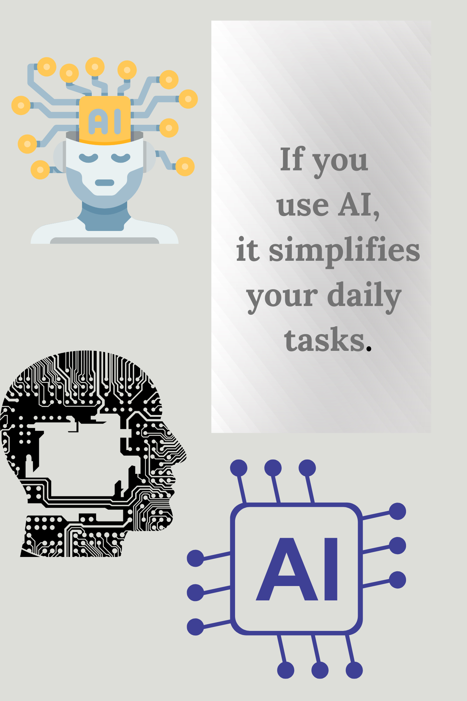
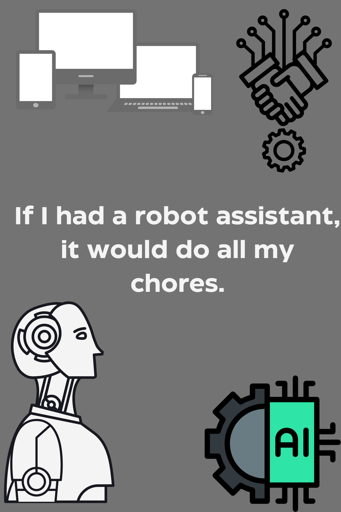
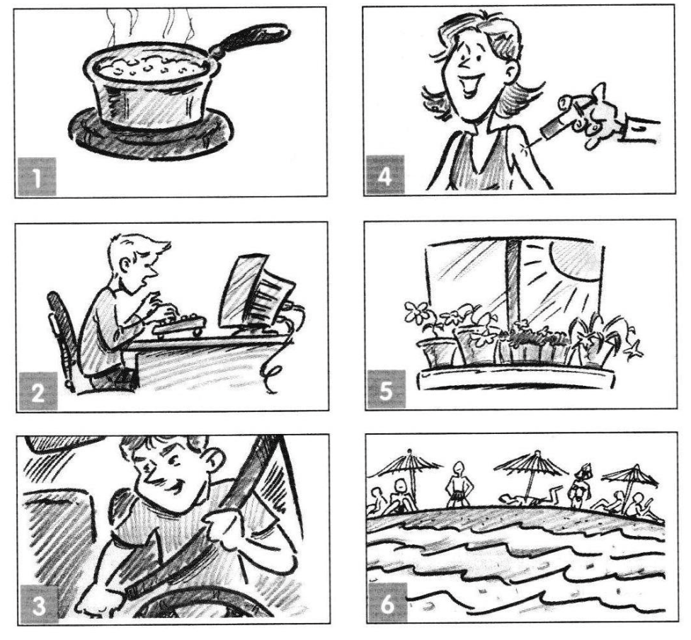

# Class 34. What if
*Use 0,1,2 conditional correctly*

## Task 1 Video and discussion 
### Part 1. 
*Answer the questions.*

- What is AI?
- Can you name some examples of AI we use every day?

---

### Part 2. 
*Watch the video and answer the questions.*

[Project Astra: Our vision for the future of AI assistants](https://youtu.be/nXVvvRhiGjI)

- Would you like to have such an assistant? 
- How can it help you in your everyday life? 

---

## Task 2. Zero and First Conditionals
### 2A 
*Look at the picture and choose the correct answer.*  

1). We use O conditional to talk about something `real/ always true`    
2). If we start a sentence with IF, we `use` comma.  
3). The first part of the sentence  is in `the present`.  

---

### 2B
*Look at the photo and choose the best option.*   

1). Does companies' success depend on AI? `yes`  
2). Are we talking about tomorrow or the past? `tomorrow`  
3). Can we use WILL after IF? `no`  

---

### 2C 
**Rules. 0 and 1 conditional**  

| Conditional Type | Structure | Example | Use |
| --- | --- | --- | --- |
| Zero Conditional | If + present simple, present simple | If you heat water to 100°C, it boils. | To talk about general truths, scientific facts, or habitual actions. |
| First Conditional | If + present simple, will + base verb | If it rains tomorrow, we will stay home. | To talk about possible or likely situations in the future and their results. |

---

### 2E

*Quiz* 

1). If she brings her phone, it won't work.  
2). If he eats a red mushroom, he will get sick.  
3). You will need, a lot of water if you want to go to the desert.  
4). If they come, here, they will see your dirty room.  
5). I could help you if you ask me.  
6). If you don't find him, we will win.  
7). If her boyfriend doesn't phone today, she might leave him.  
8). They will, catch her if she tries to escape.  
9). We won't find you if you hide in here.  
10). If you help him, you will get fired.  
11). If she doesn't phone us we will have to find her.  

---

### 2D. Video
*Watch the video*  

[Zeus & Hera (Official Video)](https://youtu.be/nUC1QA5gRcU)

> — My fellow gods the dark skies have spoken  
> — It is time for Zeus and I to retire.  
> — But where will you go?  
> — Zeus!  
> — Sorry, Zeus!  
> — I need a charge on the-  
> — WOAH  
> — Thanks  
> — Sweetie, it's not rocket science  
> — I'm heading out, don't forget to take Peggie for a walk  
> — Yo, Zeus!  
> — A little juice!  
> — That's it, I'm done with this place!  
> — We'll see about that  
> — Everything okay out there, baby?  
> — Peggie, go for a walk?  
> — I figured you could use a little pick-me-up  
> — All-Electric?  
> — All-Electric  
> — The BMW iX, Electricity in it's Ultimate Form  
> (Zeus & Hera singing Electric Avenue)  
> — BMW, the Ultimate Electric Driving Machine  

---

### 2F Practice
*Finish the sentences using 0 and 1 conditionals.*  

If the weather is nice in California, Zeus `will go for a walk with Peggie`.  
Zeus's neighbour will ask for help if `he needs a charge for his grass trimmer`.   
While playing tennis Zeus is angry if `someone asks him to charge their golf cart`.  
If Zeus forgets to walk Peggy `, she gets upset`.  
If Zeus uses the microwave `, he won't know how it works`.  
When Zeus drives an electric car `, he enjoys the power of electricity`.  

---

## Task 3. Second Conditional
### 3A.
*Look at the picture and choose the correct option.*  

  

1). Do I have a robot assistant? `no`  
2). Is it real or hypothetical situation? `hypothetical`  
3). Do we use `past simple` after IF?   

---

### 3B Rules
*Study the rules.*   

| Aspect | Details |
| --- | --- |
| Structure | If + past simple, would + base verb |
| Example Sentences | *If I had more free time, I would travel the world.*   *If she were here, she would help us.* |
| Use | To talk about unreal, hypothetical, or imaginary situations in the present or future.   Often used for dreams, wishes, or unlikely scenarios. |

---

### 3C Practice 

Звісно! Ось ті самі речення зі вставками, виділеними в Markdown-рамці:

1. If I were a boy/girl, `I would try to understand how the other gender thinks`.  
2. If I could have a super power, `I would choose to fly`.  
3. If I had to recommend a film, `I would suggest "Inception"`.  
4. If I were a celebrity, `I would use my fame to help others`.  
5. If I lived in another country, `I would learn the local language`.  
6. If I saw somebody stealing in the shop, `I would tell a security guard`.  
7. If it was my birthday today, `I would throw a big party`.  
8. If I could change one thing about myself, `I would be more confident`.  
9. If I wanted to give my best friend a surprise, `I would organize a secret trip`.  
10. If I found a lot of money in the street, `I would take it to the police`.  
11. If I saw my favorite celebrity in the supermarket, `I would ask for a selfie`.  
12. If I found a large spider in my bed, `I would scream and run away`.  
13. If I thought a friend was lying to me, `I would talk to them honestly`.  
14. If I failed an important exam, `I would try again and study harder`.  
15. If I won a lot of money, `I would travel the world and help my family`.

---

### Task 3D
*Create the questions starting with "What would you do if........?. Then ask your partner.*  
*Example: What would you do if it rained  non-stop for a month?*  

1). What would you do if you woke up and couldn't remember your name?  
2). What would you do if you lost your phone in a foreign country?  
3). What would you do if you found a secret door in your house?  
4). What would you do if animals could suddenly talk?  
5). What would you do if your best friend moved to the other side of the world?  

---

## Task 4. Speaking
*Group role-play.* 

- You will work in two groups **(Pro-AI and Anti-AI)**.  
- **Task:** Each group prepares arguments using conditionals. (0,1,2) . Time: 7min
- **Example Sentences:**    
    - *If AI helps us, we will have more time for creativity.*  
    - *If AI takes over jobs, many people will lose employment opportunities.*  
- **Present your arguments to the opposite team.**  

> 🟢 **Pro-AI Group:**
> 
> 1. **If AI helps us,** `we will have more time for creativity`. *(1st conditional)*  
> 2. **If we use AI in hospitals,** `doctors can save more lives`. *(0 conditional)*  
> 3. **If people embraced AI,** `we would solve problems faster`. *(2nd conditional)*  
> 4. **If students used AI wisely,** `they would learn more efficiently`. *(2nd conditional)*  
> 5. **If AI performs boring tasks,** `humans will focus on innovation`. *(1st conditional)*
> 
> 🔴 **Anti-AI Group:**
> 
> 1. **If AI takes over jobs,** `many people will lose employment opportunities`. *(1st conditional)*  
> 2. **If we rely too much on AI,** `we might stop thinking for ourselves`. *(1st conditional)*  
> 3. **If everyone used AI for schoolwork,** `students would stop learning properly`. *(2nd conditional)*  
> 4. **If AI makes mistakes,** `it can cause serious problems`. *(0 conditional)*  
> 5. **If I were in charge,** `I would set limits on AI development`. *(2nd conditional)*

# 📕 Home assignment 34

## Task 1
*Complete the second sentence in each pair to mean the same as the first. Use the second conditional.*  

I can't drive a car. I'm too young.  
If I ______________, ____________a car. 
> If I were older, I would drive a car. 

He won't offer you a job; you aren't reliable enough.
> If you were more reliable, he would offer you a job.  

She hasn't got a dog; her flat is really small.  
> If her flat were bigger, she would have a dog.  

I can't use my brother's phone, I don't know the password. 
> If I knew the password, I would use my brother’s phone.  

She isn't a good guitarist, she doesn't practice. 
> If she practiced more, she would be a good guitarist.  

We can't go to the beach, it isn't sunny today. 
> If it were sunny today, we would go to the beach.  

We don't have money, we can't move to the USA.  
> If we had money, we would move to the USA.  

I'm not a cat, I can't sleep all day. 
> If I were a cat, I would sleep all day.  

---

##  Task 2
*Look at the pictures and write  0,1, 2 conditional sentences.*  

> 1). If you heat soup for too long, it boils over.  
> 2). If he finishes his work early, he will play video games.  
> 3). If you wore your seatbelt, you would be safer.  
> 4). If she gets vaccinated, she will be protected from the virus.  
> 5). If plants get enough sunlight, they grow well.  
> 6). If I lived near the sea, I would go to the beach every day.  

---

## Task 3
*Finish the sentences with your own ideas. 1st or 2nd conditional is possible.* 

1). If I were trapped on an island for 10 years, ... .  
> If I were trapped on an island for 10 years, I would probably go crazy.  

2). If a bee lands on my nose ... .  
> If a robber took all my money, I would call the police.

3). If a robber took all my money ... .  
> If a robber took all my money, I would call the police.  

4). If I had a 3D printer....  
> If I had a 3D printer, I would make my own toys and tools.  

5). I'll talk to my best friend tomorrow ... .  
> I'll talk to my best friend tomorrow if I see her at school.  

6). I'd go to Bali ... .  
> I'd go to Bali if I had enough money.  

7). If I lose my memory ... .  
> If I lose my memory, I will forget everything about my life.   
