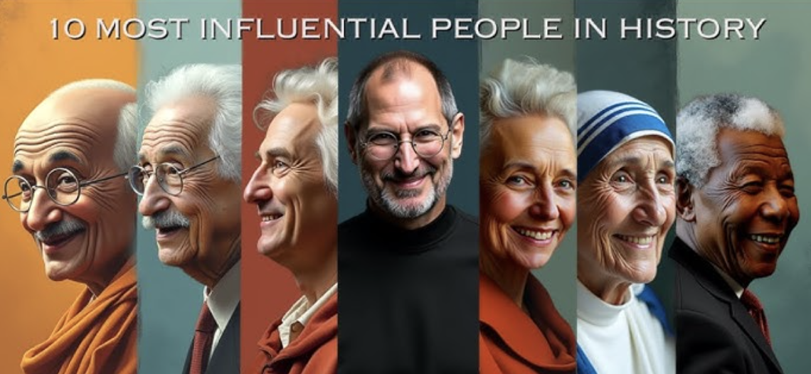

## Class 35. Big influence
*Talk about the influential people*

## Review of 1 and 2 conditional sentences
Work with your partner.  Find 4 sentences with a mistake. Correct them.

1). How would we pay for everything if access to healthcare was free?  
2). If I would have a bigger place, you could stay with me.  
3). If you worked harder, you'll earn more money.  
4). I might feel differently if I wasn't working right now.  
5). If they'd build more roads, it'd make life better.  
6). Things improved if more companies were state run.  

> 1). Correct  
> 2). If I had a bigger place, you could stay with me.  
> 3). If you work harder, you'll earn more money.  
> 4). Correct  
> 5). Correct  
> 6). Things would improve if more companies were state run.

---

## Task 1. Discuss
*Look at the photos and discuss the questions.*

1). How many of these people do you know?  
2). What do you know about them?  

---

## Task 2. Vocabulary
### 2A
*Work in pairs. Check you understand the words in bold. Then complete the sentences with the words in the box.* 
 
`trade union leader`   `architect`   `activist`   `philosopher`   `painter`   `military leader`   `lawyer`   `poet`   `athlete`   `explorer`

1). She was a famous `architect`. She **designed** lots of amazing buildings.  
2). He was a very famous `painter`. His best works are in the National Gallery.  
3). He was a famous `military leader`, who led our army to victory in several important battles.  
4). She was a famous `activist`, who fought hard for women's rights.  
5). He was a famous `trade union leader` who fought all his life for the rights of workers.  
6). She was a famous `athlete`. She won three gold medals at the Olympics.  
7). She was a famous `poet`.  She's still very popular and very widely read.  
8). She is a famous `explorer`. She was the first woman to sail round the world on her own.
9). He was a famous `philosopher`, who wrote about power, freedom and human rights.  
10). He was a famous `lawyer`, who chose to defend poor people for free!  

---

### 2B Spelling
*Check your memory, spell the words correctly.* 

1). a`thlete`  
2). e`xplorer`   
3). ph`ilosopher`  
4). v   
5). l`awyer`  
6). t`rade`  u`nion` `leader`   
7). ac`tivist`  
8). ar`chitect`

---

### 2C
*Use the words from task 2A to talk about the people in Task 1.*  
*Example: Martin Luther King was a famous activist who fought for the rights of black people.* 

---

## Task 3. Listening and grammar. Third Conditional
### 3A
*Listen to the paragraph about Steve Jobs twice and write out 3 Conditional sentences.*  

> [Audio](https://enbook.greenforest.ua/storage/uploads/2024/12/25/ElevenLabs_2024-12-25T10_11_21_Daniel_pre_s50_sb75_se0_b_m2.mp3)
>
> If Steve Jobs hadn’t started Apple in 1976 with Steve Wozniak, tech would be completely different today.   
> He revolutionized how people use technology.  
> But if he hadn’t taken risks and followed his vision, we might never have had devices like the iPhone or MacBook.   
> His innovative ideas changed the industry forever.  
> And if he hadn’t believed in thinking differently, Apple would not have become one of the most successful companies in history.  

> If Steve Jobs hadn’t started Apple in 1976 with Steve Wozniak, technology would have developed very differently.
> If Jobs hadn’t taken risks and followed his vision, we might never have had devices like the iPhone or MacBook.  
> If he hadn’t believed in thinking differently, Apple wouldn’t have become one of the most successful companies in history.  

---

### 3B
*Look at the sentence and answer the questions.*  
 
**If Steve Jobs hadn’t started Apple in 1976 with Steve Wozniak, the tech world would have been completely different today.**  
1). Did Steve Jobs start Apple in 1976?  `yes`  
2). Would the tech world be the same without Apple? `no`  
3). Does this sentence talk about  `imaginary`   situation in the past?  
4). Is the sentence about  `something that didn't happen`  
5). Is this sentence about  `the past` ? 
6). In the condition clause we often use if + `past perfect`  
7). In the result clause we often use would have + `past participle`  
8). The condition clause can come  `first or second`  

### 3C Rules
*Study the rules.*

**THIRD CONDITIONAL**  

| Structure | Example | Explanation |
| --- | --- | --- |
| **If + past perfect**, would + have + past participle | If he **had studied**, he **would have passed** the exam. | Refers to an unreal past situation and its imagined result. |
| **If + past perfect**, could + have + past participle | If she **had worked harder**, she **could have succeeded**. |	Indicates possibility or ability in the past that didn’t happen. |

Instead of WOULD, we can use `might (not)`/`may (not)`/could +have +past participle for less certain results.

---

### 3D Pronunciation
*Listen and notice the pronunciation of the underlined phrases.* 

Listen again and repeat.  
1). `If I'd` stayed there, `things might've been` very different.  
2). `I wouldn't have` gone `if she hadn't` persuaded me to.  
3). `It would never have` happened `if you'd been` listening!  
4). `If I hadn't been` staying there, `we'd never have` met.  

---

### 3F Practice
*Complete the sentences with the correct form of the verbs in brackets.*  

1). If  Nelson Mandela `hadn't been` (not be) released from prison in 1990, the situation in South Africa might `have become` (become) violent.  
2). Marie Curie would `not have made` (not make) her discoveries if she `had been` (be) scared of being wrong.  
3). If  Leonardo da Vinci `hadn't had` (not have) rich friends who paid for his work, he could easily `have been` (be) just another struggling artist!  
4). I'm lucky! If I `hadn't worked` worked (not work) late that day,  I would `have been` (be) on the train that crashed!  
5). If it `hadn't been` (not be) for my English teacher,  I would probably `have left` (leave) school at 16.  
6). I would `have never gone` (never go) to university if my math teacher  hadn't `hadn't encouraged` (not encourage) me to.  
7). If she `hadn't worked` (not work) in the shop the day that I went in, we might  `have never met` (never meet) . 

---

### 3G What if: rewrite history

*Work in pairs or small groups. Choose a historical event or scenario  For example, you can choose from these👇🏼:*  

- The sinking of the Titanic
- The invention of the telephone
- The fall of the Berlin Wall
- Ukraine’s independence in 1991

Each group must come up with at least two "what if" sentences about the event using the third conditional.

Example:
- If the Titanic had had enough lifeboats, more people could have survived.  
- If Ukraine hadn’t declared independence in 1991, it might have remained part of the Soviet Union.  

> If Alexander Graham Bell hadn’t invented the telephone, people would have communicated only by letters for a much longer time.  
> If the telephone hadn’t been invented, the development of the internet might have been delayed.  

---

## Task 4. Speaking
*Think of a person who has had a big influence on the world, on your country or on you personally. Google them if necessary.*  

Think about:  
• when they lived.  
• why they were important and how they changed things  

IDEAS:

**Bohdan Khmelnytsky (1595–1657)**  
Leader of the Cossack Hetmanate and hero of the Ukrainian struggle for independence during the mid-17th century.  

**Taras Shevchenko (1814–1861)**  
Poet, artist, and national symbol of Ukraine, often called "the father of Ukrainian literature." His works inspired Ukrainian identity and independence movements.  

**Valeriy Lobanovskyi (1939–2002)**  
Legendary football coach who put Ukrainian sports on the world map with Dynamo Kyiv's successes.  

**Volodymyr Zelenskyy (1978–)**  
Current President of Ukraine, leading the nation during the 2022 Russian invasion and becoming a symbol of Ukrainian resistance on the global stage.  

**Andriy Shevchenko (1976–)**  
Football star and ambassador of Ukrainian culture, promoting the country’s international image.  

> The person I chose is Taras Shevchenko. He lived from 1814 to 1861.  
>   
> He was a famous Ukrainian poet, writer, and artist. He is often called “the father of Ukrainian literature.”  
> Shevchenko had a huge influence on Ukrainian culture and national identity.  
>   
> If he hadn’t written his poems in the Ukrainian language, our national literature might not have developed so strongly.  
> His works gave people hope and inspired the fight for freedom.  
>   
> If Taras Shevchenko had not spoken out against injustice, he wouldn’t have become a symbol of Ukrainian resistance.  
>   
> Even today, his poems are studied in schools, and people admire him as a national hero.  

## Audio script
If Steve Jobs hadn’t started Apple in 1976 with Steve Wozniak, the tech world would have been completely different today. He revolutionized how people use technology, but if he hadn’t taken risks and followed his vision, we might never have had devices like the iPhone or MacBook. His innovative ideas changed industries forever, and if he hadn’t believed in thinking differently, Apple would not have become one of the most successful companies in history.

# 📕 Home assignment 35

## Task 1. Rules
*Fill in the table.*  

 
| GRAMMAR STRUCTURE | MEANING | FORMULA |
| --- | --- | --- |
| 0 – CONDITIONAL | Scientific facts, habits | If + `present simple` + `present simple` |
| 1ST CONDITIONAL | Real/possible situations | If + `present simple` + `will` |
| 2ND CONDITIONAL | Imagined (unrealistic) present | If + `past simple` + `would` | 
| 3 rd CONDITIONAL | Unreal situations about the past | If + `past perfect` + `would have + past participle` |