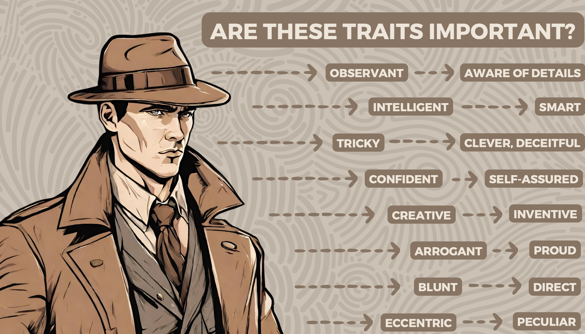
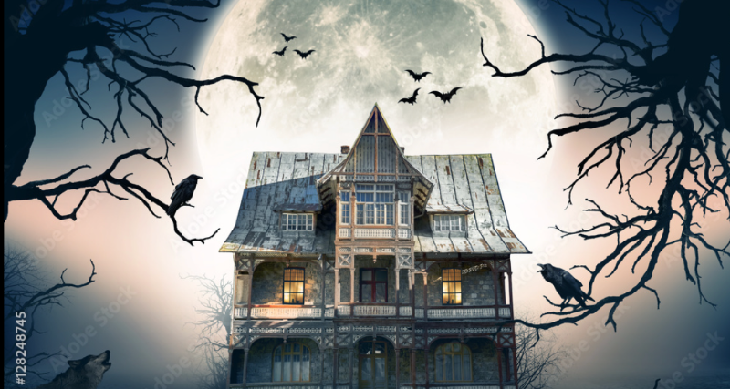
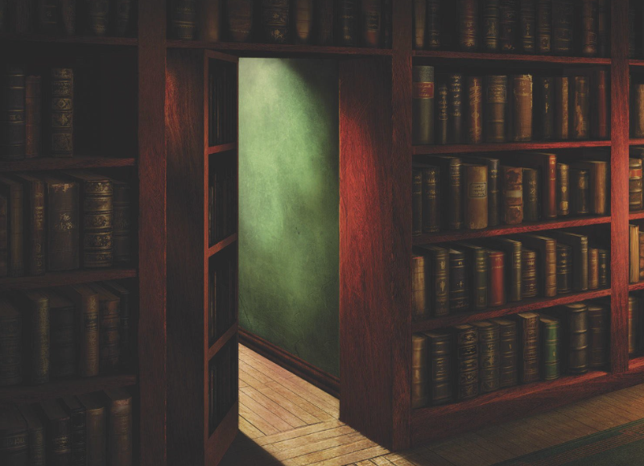
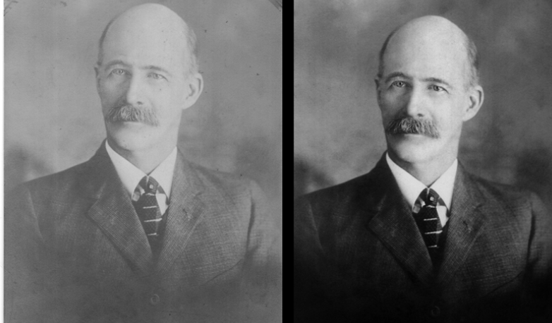
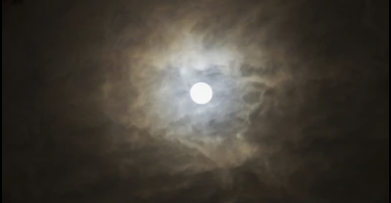
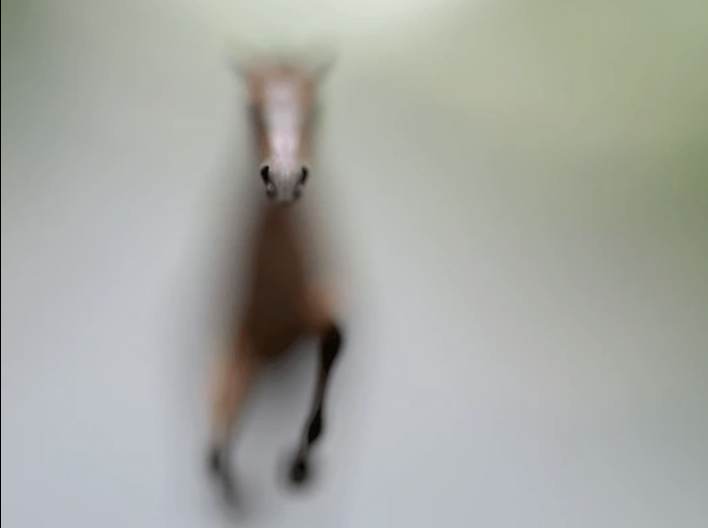
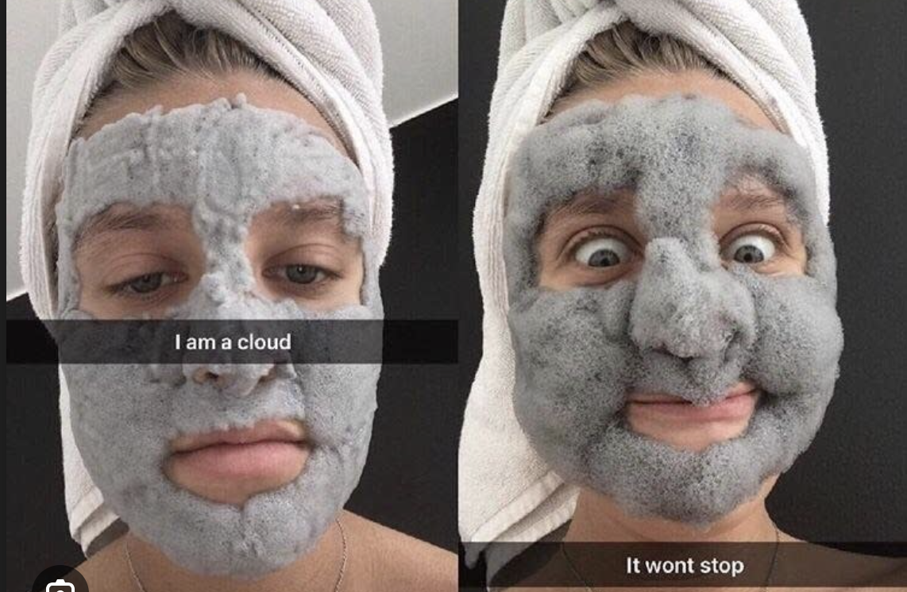
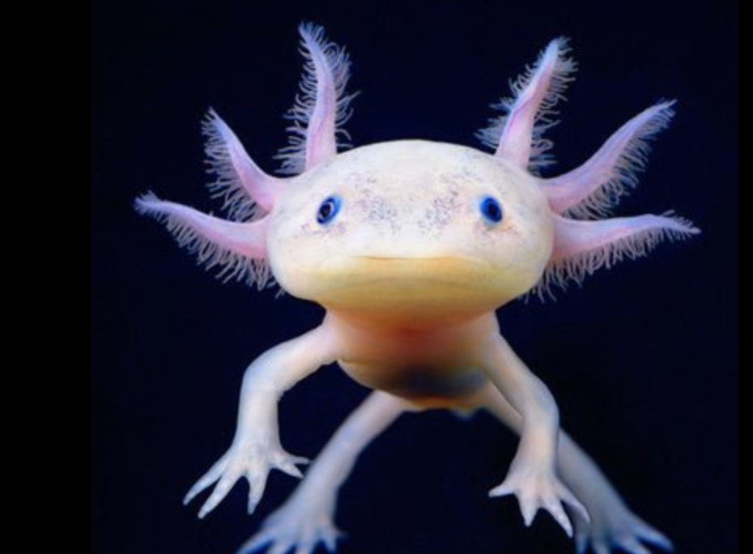

# 📗 Class 36. Crime
*Solve crimes using modals of deduction.* 

## Review of conditionals
> [!NOTE]  
> *Sort out the sentences and translate them into English.*  

`If ... Past Simple - would + infinitive (without to) `  
Якби Джон був тут, він би знав, що робити.  
Куди б ви подорожували, якби були багаті?  
Якби він був хорошою людиною, він би не ставився до людей так погано.  
Шкода, що ти не знаєш французької. Якби ти знав французьку, тто отримав би роботу в готелі.  
Вибач, я не можу кудись піти. Я б вийшов, якби не цей жахливий головний біль.  
`If ... Past Perfect - would + have + Ved/v3`  
Я б прибрала в домі, якби знала, що ти приїдеш.  
Очевидно, якби мої батьки не зустрілися, я б не з'явився на світ.  
Ми б принесли перекусити, якби ви сказали нам про пікнік.  

---

## Task 1. Video and discussion
> [!NOTE]  
> *Watch the video [here](https://www.tiktok.com/@groovy.smoothy/video/7250499642012552475?_r=1&_t=8k7oV2EKxoz) and discuss the questions.*  

Do you like detective shows?
What are your ravourite detective shows?
Do you know Sherlok Holmes?
What makes detective good?

---

## Task 2. Vocabulary
### 2A Traits a detective needs
> [!NOTE]  
> *Discuss with your partner whether these traits[🌐](# "trait [трет] — риса, особливість 🌐 Honesty and kindness are important personality traits. 🛠️ noun") are important for the detective.*

observant[🌐](# "observant [обзервент] — спостережливий 🌐 She's very observant and notices even the smallest details. 🛠️ adjective") → aware of details[🌐](# "aware [евеер] — обізнаний щодо деталей 🌐 He is always aware of details when reviewing contracts. 🛠️ adjective phrase")  
intelligent[🌐](# "intelligent [інтеліджент] — розумний 🌐 She's one of the most intelligent students in the class. 🛠️ adjective") → smart  
tricky[🌐](# "tricky [трікі] — хитрий, складний 🌐 This puzzle is really tricky to solve. 🛠️ adjective") → clever[🌐](# "clever [клевер] — кмітливий, розумний 🌐 That was a clever solution to the problem. 🛠️ adjective"), deceitful[🌐](# "deceitful [десітфул] — брехливий, оманливий 🌐 He was caught being deceitful about his past. 🛠️ adjective")  
confident[🌐](# "confident [конфідент] — впевнений 🌐 She felt confident before the interview. 🛠️ adjective") → self-assured[🌐](# "self-assured [селф ешу́рд] — самовпевнений, упевнений у собі 🌐 He gave a self-assured presentation in front of the whole team. 🛠️ adjective")  
creative[🌐](# "creative [кріейтив] — творчий, креативний 🌐 She's a creative designer with unique ideas. 🛠️ adjective") → inventive  
arrogant[🌐](# "arrogant [арогант] — пихатий, зарозумілий 🌐 He sounded arrogant during the meeting. 🛠️ adjective") → proud[🌐](# "proud [прауд] — гордий 🌐 She was proud of her accomplishments. 🛠️ adjective")  
blunt[🌐](# "blunt [блант] — прямолінійний, різкий; тупий 🌐 He was too blunt when he gave his opinion. 🛠️ adjective") → direct[🌐](# "direct [дайрект] — прямий, відвертий 🌐 She gave a direct answer to the question. 🛠️ adjective")  
eccentric[🌐](# "eccentric [ексентрік] — дивакуватий, ексцентричний 🌐 His eccentric behavior made him stand out in the crowd. 🛠️ adjective") → peculiar[🌐](# "peculiar [пік'юлієр] — своєрідний, дивний 🌐 There's something peculiar about his accent. 🛠️ adjective")  

---

### 2B Cards
> [!NOTE]  
> *Look at the definition of the following words and name them.*  

1). pays a lot of attention to things and notices more about them than most people do. `observant`  
2). the ability to think, understand quickly `clever` `intelligent`  
3). behaves in a proud unpleasant[🌐](# "unpleasant [анплезент] — неприємний 🌐 He had an unpleasant experience at the restaurant. 🛠️ adjective") way towards other people because they believe that they are more important than others. `arrogant`   
4). has respect for themselves and does not want to lose the respect that other people have for them `proud`  
5). you are certain that it will happen in the way you want it to `confident`  
6). they are strange or unusual, sometimes in an unpleasant way. `peculiar`  
7). you say exactly what you think without trying to be polite `blunt`  
8). they behave in a strange way, and have habits are different from those of most people. `eccentric`  
9). shows confidence in what they say and do `self-assured`  
10). they are likely to deceive[🌐](# "deceive [десів] — обманювати 🌐 He tried to deceive everyone with his lies. 🛠️ verb") you or cheat[🌐](# "cheat [чіт] — обдурювати, шахраювати 🌐 He was caught trying to cheat on the exam. 🛠️ verb") you `tricky` `deceitful`  
11). means having knowledge or understanding of specific, often small, pieces of information about something `aware of details`  
12). the ability to think creatively and come up with new ideas, solutions, or methods `creative` `inventive`  
13). deliberately[🌐](# "deliberately [делібретлі] — навмисно, свідомо 🌐 She deliberately ignored his message. 🛠️ adverb") misleading[🌐](# "misleading [міслі́дінг] — оманливий, що вводить в оману 🌐 The advertisement was misleading and caused confusion. 🛠️ adjective") or dishonest[🌐](# "dishonest [дісонист] — нечесний, брехливий 🌐 It was dishonest of him to lie about the money. 🛠️ adjective"), often with the intent to trick or deceive others. `deceitful`  
14). can develop and invent original ideas `inventive`   

---

### 2С Discuss
> [!NOTE]  
> *Discuss with your partner what 5 traits should a good detective have. Why?* 

---

## 2D Quiz
> [!NOTE]  
> *Discuss the questions in  the quiz . Compare your answers with your partner.* 

1). Do you often find yourself noticing small details that others might miss? `Not sure`  
2). How would you describe you problem-solving skills? `I am intelligent`  
3). Are you good at thinking outside the box (нестандартно) and coming up with creative solutions? `Yes, I am creative`  
4). How would you describe your level of confidence in making decisions? `Somewhat confident`  
5). Are you direct and straightforward in your communication? `It varies`  
6). Do you consider yourself to be proud of your achievements? `No, I prefer to stay humble (скромний)`  

---

## Task 3. Detectives around the world
> [!NOTE]  
> *Read the info below ans answer the questions.*  

**Detectives around the world**

1). Some police investigations have involved the use of "psychic detectives" who claim[🌐](# "claim [клейм] — стверджувати, вимагати; заява, претензія 🌐 She claimed she had seen a UFO. 🛠️ verb, noun") to have extrasensory perception (esp) to solve crimes.  
2). In the Netherlands, police have trained eagles to assist in taking down illegal drones.  
3). Is some countries, including Japan, police have experimented with using specific scents[🌐](# "scent [сент] — аромати, запахи 🌐 The garden was filled with the sweet scents of blooming flowers. 🛠️ noun (plural)") to help witnesses recall details of a crime scene.  
4). A police station is Scotland made headlines[🌐](# "headline [хедлайн] — заголовки 🌐 The scandal made headlines around the world. 🛠️ noun (plural)") for adopting a stray[🌐](# "stray [стрей] — бездомний, заблукати, випадковий 🌐 A stray dog followed me home. 🛠️ adjective, verb, noun") cat named PC Thumper as their "police cat." Thumper became a mascot[🌐](# "mascot [маскот] — талісман 🌐 The team’s mascot entertained the crowd during halftime. 🛠️ noun").  
5). Underwater crime scene investigation is a specialized field where forensic[🌐](# "forensic [форенсік] — судовий, криміналістичний 🌐 The police used forensic evidence to solve the case. 🛠️ adjective") divers use advanced techniques  to collect evidence in bodies of water[🌐](# "body of water [боді ов вотер] — водойма 🌐 Lakes, rivers, and oceans are all bodies of water. 🛠️ noun phrase (plural)").

- Trust a cat of trust an eagle?  
- Trust psychic detectives or a witch?  
- Trust your eyes or trust your nose?  
- Solve crimes under the water or in a desert?  
- Rely[🌐](# "rely [ріла́й] — покладатися, довіряти 🌐 You can always rely on her in difficult situations. 🛠️ verb") on scents[🌐](# "scent [сент] — аромати, запахи 🌐 The garden was filled with the sweet scents of blooming flowers. 🛠️ noun (plural)") or on taste?  

---

## Task 4. Reading and grammar (modals of deduction: present)
## 4A Reading vocabulary
> [!NOTE]  
> *Study the vocabulary from the text you're going to read.*  

  
haunted[🌐](# "haunt [хонтід] — населений привидами, переслідуваний 🌐 They say the old castle is haunted by ghosts. 🛠️ adjective") house  

  
dimly[🌐](# "dimly [дімлі] — тьмяно, слабо 🌐 The room was dimly lit by a single candle. 🛠️ adverb") lit[🌐](# "light [літ] — освітлений, запалений 🌐 The hallway was lit by small ceiling lights. 🛠️ adjective (past participle of 'light')")  

  
secret passage[🌐](# "passage [пасідж] — прохід, уривок, коридор 🌐 The narrow passage led to a hidden room. 🛠️ noun")

  
faded[🌐](# "fade [фейдед] — вицвілий, зниклий 🌐 The colors of the old photo had faded over time. 🛠️ adjective (past participle of 'fade')") photograph  

  
locked chest[🌐](# "chest [чест] — скриня, груди 🌐 He opened the wooden chest to reveal the treasure. 🛠️ noun")

---

### 4B
> [!NOTE]  
> *Read the text about  detective Harper and pay attention to underlined words.* 

**STORY TIME**

Late at night, Detective Harper found herself standing in front of the old mansion that had long been rumored[🌐](# "rumor [румерд] — за чутками, пліткували 🌐 The house is rumored to be haunted. 🛠️ adjective (past participle of 'rumor')") to be haunted[🌐](# "haunt [хонтід] — населений привидами, переслідуваний 🌐 They say the old mansion is haunted by spirits. 🛠️ adjective"). As she cautiously entered the dimly lit foyer, strange sounds echoed through the house.  

"This place <ins>must</ins> have a history filled with secrets." She felt an uneasy presence, and her instincts told her that something significant <ins>must</ins> have happened here.  

As she explored further, Detective Harper stumbled[🌐](# "stumble [стамблд] — спіткнувся, натрапив 🌐 He stumbled on a rock while walking in the dark. 🛠️ verb (past tense of 'stumble')") upon[🌐](# "upon [апон] — на, після, з моменту 🌐 Upon entering the room, she felt a sudden chill. 🛠️ preposition") a hidden door concealed[🌐](# "conceal [консі́лд] — прихований, замаскований 🌐 The door was concealed behind a curtain. 🛠️ adjective (past participle of 'conceal')") behind a bookshelf. "This <ins>may</ins> lead to the heart of the mystery." With a deep breath, she pushed the door open, revealing a secret passage that seemed to wind its way beneath the mansion.  

In the underground chambers, she discovered old journals and faded photographs. Clues that hinted at a hidden treasure or a long-lost family secret. Detective Harper knew she <ins>might</ins> be on the brink of uncovering a story that had been buried for decades.  

In the dim light, she found a locked chest that can hold the key to the mansion's enigma. "This <ins>must</ins> be the final piece of the puzzle," she thought. With a sense of anticipation, Detective Harper opened that chest, revealing[🌐](# "reveal [ріві́лінг] — викривальний, що показує; відвертий 🌐 Her expression was quite revealing of her true feelings. 🛠️ adjective") a collection of letters that revealed a tale of love, betrayal, and a fortune lost to time.  

As she pieced together the fragments of the past, Detective Harper realized that this mansion, which once seemed haunted, was actually haunted by the weight of its own secrets. The mysteries hidden within its walls unfolded[🌐](# "unfold [анфо́лдед] — розгорнувся, відкрився 🌐 A surprising story unfolded before our eyes. 🛠️ verb (past tense of 'unfold')") like a carefully crafted story, and she knew she had uncovered a truth that <ins>might</ins> change the way the world saw this mysterious place forever.

---

### 4C Rules. Modals of deduction in the present
> [!NOTE]  
> *Read the rules and choose the correct option.*  

**Modals of Deduction in the present**  
We can use modal verbs for deduction – guessing if something is true using the available information. The modal verb we choose shows **how certain** we are about the possibility.  

a).  We use `must` when we feel <ins>sure</ins> that something is true or it's the only realistic possibility.

> *This must be her house. I can see her car in the garage.*  
> *He must live near here because he always walks to work.*  

b). We use `might`, `may` or `could` to say that we think something is <ins>possible</ins> but we're not sure. 

> *She's not here yet. She might be stuck in traffic.*  
> *He's not answering. He could be in class.*

c). We use `can't` when we feel <ins>sure</ins> that something is <ins>not possible</ins>.

> *It can't be far now. We've been driving for hours.*  
> *She can't know about the complaint. She's promoted him to team leader.*  

---

### 4E
> [!NOTE]  
> *Look at the pictures and write sentences describing them.*  
> ***Example:*** *It must be a girl on the picture.*  

1).   
> It must be a woman or girl but it can't be a child.

2).   
> It must be the moon.

3).   
> It might be a toy horse.

4).   
> It must be a temple in Asia.

5).   
> It could be her first time using this mask.

6).   
> It must be an axolotl.

7).   
> It might be their vacation.  

