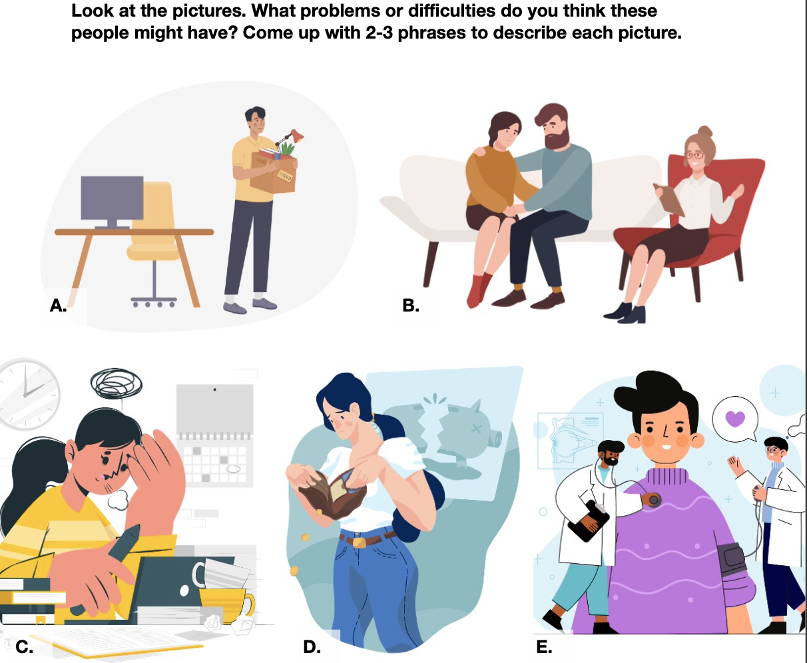

# 📗 Class 37. Dealing with hardships
> [!NOTE]  
> *Role-play the dialogue expressing emotions, sympathy and support*  

## Task 1. Discuss 

SUGGESTED VOCABULARY: 
- ***in therapy***: the process of actively participating in sessions with a trained therapist
- ***health issues/bad health***: to have problems with health
- ***to be fired***: to lose your job due to the decision of your employer
- ***busy as a bee; to be snowed under***: to have too many things to do

Discuss the questions in pairs:

1). Have you ever experienced anything similar?
2). How did you deal with these problems?

---

## Task 2. Reading
> [!NOTE]  
> *Work in a groups of 3. Choose one dialogue and read it. Then retell it to your partner. What worries do people have in each dialogue?*

`A` Hey, man. I've got some really bad news. I just lost my job.  
`B` Oh, no, dude! I'm so sorry to hear that. That's rough[🌐](# "rough [раф] — грубий, жорсткий, нерівний 🌐 The surface of the rock was rough to the touch. 🛠️ adjective"). How are you holding up?  
`A` Thanks, man. It's hitting me pretty hard. I ***didn't see coming[🌐](# "not see coming [диднт сі камінг] — не очікувати, не передбачити 🌐 That plot twist was something I really didn't see coming. 🛠️ idiom")***, and I fell kind of lost right now.  
`B` I can imagine how stressful that must be for you. Hang in there[🌐](# "hang in there [хэн ін зеер] — тримайся, не здавайся 🌐 I know things are hard right now, but hang in there! 🛠️ idiom"), though. You're a talented guy, and I'm sure you'll find a god job!  
`A` I'm worried about paying the bills and finding a new job. You know it's quite hard to find a good job these days.  
`B` Have you thought about updating your CV and ***reaching out[🌐](# "reach out [річінґ аут] — звертатися, протягувати руку, встановлювати контакт 🌐 She is reaching out to old friends for support. 🛠️ phrasal verb")*** to your contacts?  
`A` I've started updating my resume, but I haven't reached out to anyone yet. I guess I'm feeling a bit embarrassed[🌐](# "embarrass [ембе́рес] — збентежений 🌐 He felt embarrassed after forgetting her name. 🛠️ adjective") about the whole situation... It's just hard to stay positive in this situation, you know?  
`B` Absolutely... It's completely normal to have those moments of frustration[🌐](# "frustration [фрастре́йшн] — розчарування, фрустрація 🌐 He couldn't hide his frustration after losing the game. 🛠️ noun"). Just remember that you have friends who support you and believe in you. I'm always here for you.  

 

`A` Hey, I've been stressing out[🌐](# "stress out [стрес аут] — нервувати, сильно переживати 🌐 She's been stressing out over the final exams. 🛠️ phrasal verb") a lot lately. My finances are a ***total mess[🌐](# "total mess [то́тл мес] — повний безлад 🌐 After the party, the house was a total mess. 🛠️ noun phrase")***, and I don't know how to handle[🌐](# "handle [ге́ндл] — справлятися, керувати 🌐 He knows how to handle difficult situations. 🛠️ verb") it.  
`B` I'm not surprised! Cancel all your subscriptions, stop eating out[🌐](# "eat out [іт аут] — їсти не вдома, харчуватись у закладах 🌐 We enjoy eating out on weekends. 🛠️ phrasal verb"), and sell all your unnecessary stuff. It's not that hard, you know? You've been always ***living beyond your means[🌐](# "live beyond one's means [лівінґ бі'йонд ёр мінз] — жити не по кишені 🌐 He's constantly in debt because he's living beyond his means. 🛠️ idiom")***! It's time to stop!  
`A` Um, okay. I appreciate[🌐](# "appreciate [епрі́шіейт] — цінувати, усвідомлювати 🌐 I really appreciate your help with the project. 🛠️ verb") the advice, but I've already been trying to cut back[🌐](# "cut back [кат бек] — скорочувати, зменшувати (витрати, споживання тощо) 🌐 We need to cut back on our spending this month. 🛠️ phrasal verb") where I can. It's just not that simple...  
`B` And have you considered getting a second job? Just start working your ass off[🌐](# "ass off [ес оф] — до нестями, дуже сильно (вислів використовується для підсилення дії) 🌐 He was working his ass off to finish the project on time. 🛠️ idiom (informal, vulgar)"). It's the only way to get out of this mess.  
`A` Yeah, I know... It takes time and effort[🌐](# "effort [е́ферт] — зусилля, старання 🌐 She put a lot of effort into preparing for the exam. 🛠️ noun") to find the right opportunity that fits my schedule and skills.  
`B` Oh, come on! You're just ***making excuses[🌐](# "make excuses [мейкінґ екск'юзіз] — виправдовуватись, знаходити відмовки 🌐 He’s always making excuses for being late. 🛠️ verb phrase")*** now. Stop being lazy and start taking control of your life.  
`A` Look, I fell like you're being a bit too pushy[🌐](# "pushy [пуші] — наполегливий до настирливості, агресивно впертий 🌐 The salesperson was too pushy, so I left the store. 🛠️ adjective")... I'm already doing my best here, and what I need right now is some support and understanding, not more pressure.  
`B` Fine, whatever. If you want to be broke, it's ok, be my guest. Just don't come crying to me when you're still broke and miserable[🌐](# "miserable [мі́зерабл] — нещасний, жалюгідний 🌐 He felt miserable after the argument. 🛠️ adjective")... I always wanted what's better for you...  

 

`A` Hey, I wanted to talk yo you about something that's ***been on my mind[🌐](# "be on someone's mind [бін он май майнд] — не йде з голови, постійно думати про щось 🌐 You've been on my mind all day. 🛠️ idiom")***. I'm ***going through a really tough patch[🌐](# "go through a (tough) patch [ґоінґ θру е рілі тaф пач] — переживати важкий період 🌐 She's going through a really tough patch at work. 🛠️ idiom")*** with my boyfriend, and it's been draining[🌐](# "drain [ітс бін дрейнінґ] — це виснажує, це виснажливо 🌐 It's been draining dealing with all these problems. 🛠️ expression (verb phrase)")...  
`B` Oh no, sweetheart. I'm so sorry to hear that. I'm here for you. What's been going on? Do you want to share?  
`A` We've been arguing a lot, and it feels like we're ***drifting apart[🌐](# "drift apart [дрифтіґ епарт] — віддалятись один від одного (емоційно) 🌐 We used to be close, but we’ve been drifting apart lately. 🛠️ phrasal verb")***. We decided to give couple therapy a try to work through our issues.  
`B` I can only imagine how difficult that must be for both of you. Here's my two cents: try to listen to each other without all the judgment. Communication is the secret sauce!  
`A` You're totally right. We gotta[🌐](# "gotta [ґота] — розмовне скорочення від 'got to', означає 'повинен' 🌐 I gotta go now, see you later! 🛠️ informal contraction (modal expression)") work on our communication. It won't be easy, but I want to ***give it a shot[🌐](# "give it a shot [ґів іт е шот] — спробувати, дати шанс 🌐 I’ve never tried skiing before, but I’ll give it a shot. 🛠️ idiom")***.
`B` And hey, don't forget about yourself in all this mess. Take care of yourself. Do things that make you happy...  
`A` Thanks, girl, for keeping it real and ***having my back[🌐](# "have someone's back [гевінґ май бек] — підтримувати, бути на боці 🌐 Thanks for always having my back. 🛠️ idiom")***. Your advice and support ***mean the world to me[🌐](# "mean the world to someone [мін зе ворлд ту мі] — дуже багато значити для когось 🌐 Your support means the world to me. 🛠️ idiom")***.  

VOCABULARY: 
 - ***that's rough***: це важко/ неприємно
 - ***hang in there***: тримайся
 - ***I don't know how to handle it***: не знаю, як з цим впоратись
 - ***work your ass off***: впахувати, гнути спину, працювати до сьомого поту
-  ***pushy***: надмірно наполегливий
 - ***in all this mess***: у свій цій плутанині
 - **couple therapy**: сімейна терапія

---

## Task 3. Conversation
> [!NOTE]  
> *Discuss this questions.*  

1). Do you know someone who’s lost their job? How are they holding  up?  
2). Do you know someone who’s giving toxic advice? How do you react to such people?  
3). What advice can you give to the person in Dialogue 2?  
4). Do you think couple therapy can help couples understand each other better?  
5). How often do you share your hardships with friends?  

---

## Task 4. Functional language. Express emotions, sympathy, give advice
> [!NOTE]  
> *Match the definitions to the vocabulary items.* 

`1` gradually[🌐](# "gradually [ґраджуелі] — поступово 🌐 He gradually improved his English by practicing every day. 🛠️ adverb") become less intimate[🌐](# "intimate [і́нтімейт] — близький, інтимний 🌐 They had an intimate conversation about their relationship. 🛠️ adjective") or friendly  
`f` to drift apart  

`2` to be surprised by something unexpected  
`i` I didn't see it coming  

`3` to spend more money than you can afford  
`h` live beyond your means  

`4` to provide reasons to avoid responsibility  
`j` make excuses  

`5` something that is very disorganized or chaotic  
`k` a total mess  

`6` to think about something  
`g` to be on my mind  

`7` to experience a difficult period in one's life  
`b` go through a really tough patch  

`8` to contact or connect with someone   
`l` to reach out  

`9` to try something  
`e` to give it a shot  

`10` to support someone  
`a` to have someone's back  

`11` to feel free to do something  
`d` be my guest  

`12` to be extremely important  
`c` to mean the world to someone  

---

## Task 5. Lexical note
> [!NOTE]  
> *Check out the vocabulary on each card and answer the questions.* 

1). 
> `drift apart`  
> • Have you ever drifted apart with any of your friends? What were the reasons?  
> • Do you think you can reconnect with a person after you've drifted apart?  

2). 
> `make exuses`  
> • What excuses would you make of you were late for a birthday party? For work?  
> • Have you evver made wild excuses? (people find them difficult to believe)

3).
> `to be on my mind`  
> • What's been on your mind recently?  
> • Is there something on your mind right now that's distraction you?  
> • How do you clear your head when too much is on your mind? 

4). 

> `to mean the world to someone` (Look at those sentences. Can you relate to them?)  
> • You mean the world to me, and I can't imagine my life without you.  
> • Her support during though times, has meant the world to me.  
> • That gift may seem small, but it means the world to him.  

---

## Task 6. Practice
> [!NOTE]  
> *Complete the sentences with the words from Task 4.*  

`Reach out`   `back`   `beyond my means`   `means a lot to me`   `a shot`   `tough`   `on my mind`   `drifting apart`   `my guest`   `it coming`   `mess`

1). Right now, everything feels like a total `mess`, but together we can find solutions.  
2). I've realized that I've been living `beyond my means`, and it's causing me financial stress.  
3). `Reach out` to me anytime for support. I'm here for you.  
4). If there's something you want to try, give it `a shot`!  
5). I didn't see `it coming`, but I know we'll find a way through.  
6). It feels like we've been `drifting apart` recently, but our friendship means a lot to me.  
7). Your friendship `means a lot to me` to me. You're an important part of my life.  
8). I want you to know that I have your `back`, my friend.  
9). If you have a different perspective or solution, be `my guest` and share it with me. (sarcastic)  
10). You've been `on my mind` a lot lately, and I want you to know that I'm here to support you through this `tough` patch.  

---

## Task 7. Sorting

> [!NOTE]  
> *Put the phrases  in the boxes.*  

| Express emotion | Give advice | Express sympathy and support |
| --- | --- | --- |
| `to mean the world to someone` | `be my guest` | `to have someone's back` |
| `a total mess` | `to give it a shot` | `to reach out` |
| `I didn't see it coming` | |  |
| `to go through a really tough path` |  |  |

---

## Task 8. Speaking

> [!NOTE]  
> *Complete the dialogues using the instructions and your own ideas.*  

 

> `Your friend` I'm struggling with my studies.  
> `You ` express sympathy and support  
> `Your friend` express your emotions  
> `You` give advice  

 

> `Your friend` I'm so stressed with all these exams.  
> `You ` ask how your friend feels  
> `Your friend` express your emotions  
> `You` express sympathy and support  

 

> `Your friend` I've just broken up with my boyfriend...  
> `You ` express sympathy and support  

 

> `Your friend` I've just lost my job.  
> `You ` give advice  
 

> `Your friend` I'm dealing with a health issue.  
> `You ` ask how your friend feels  
> `Your friend` express your emotions  

---

## Task 9. Role-plays

> [!NOTE]  
> *Role-play the dialogues in pairs. Keep them going for as long as you can.*  

**Situation 1**  
`Student A` you're missing your family  
`Student B` support your friend and give them advice  

 

**Situation 2**  
`Student A` you're struggling with work-life balance  
`Student B` support your friend and give them advice    

---

# Home assignment 
## Task 1

> [!NOTE]  
> *Rewrite the sentences below using the given vocabulary phrase so the meaning stays the same. You might need to change verb tenses in some sentences.*  

1). She has been thinking about the presentation all day. (be on my mind)  
> The presentation has been on her mind all day.  

2). He worked extremely hard to finish his project on time. (work your ass off)  
> He worked his ass off to finish his project on time.  

3). The opportunity to visit Paris was very special to her. (mean the world to someone)  
> The opportunity to visit Paris meant the world to her.  

4). She allows me to use her laptop whenever I need it. (be my guest)  
> Whenever I need to use her laptop, she just says, "Be my guest."  

5). The salesperson was too aggressive, so I didn't buy anything. (pushy)  
> The salesperson was too pushy, so I didn't buy anything.  

6). My life was so disorganized in 2024. (a total mess)  
> My life was a total mess in 2024.  

7). She wasn't sure if she’d like dancing, but she decided to try. (give it a shot)  
> She wasn't sure if she’d like dancing, but she decided to give it a shot.  

---

## Task 2

> [!NOTE]  
> *Complete the sentences with appropriate phrases.*  

1). You've been `working your ass off` all week, so you deserve a break this weekend.  
2). My dog `means the world` to me; I can't imagine life without her.  
3). I need to decide on the decorations for the party—they've been `on my mind` all day.  
4). He wasn't sure he could solve the problem, but he decided to `give it a shot`    
5). "Can I sit here?" "Sure, `be my guest`!"  
6). The salesperson was so `pushy` that I decided not to buy anything from the store.  
7). After the party, the house was `a total mess`, and it took hours to clean up.  

---

## Task 3. Writing

> [!NOTE]  
> *Write a short paragraph (100–120 words) about a memorable situation in your life using at least four of the following phrases:*  
> • Mean the world to someone  
> • Be on my mind  
> • Have someone's back  
> • Work your ass off  
> • I didn't see it coming  
>
> "Describe a time when you worked hard on something or supported someone important to you"  
>
> ***Example***: Last year, I worked my ass off to prepare a surprise party for my best friend. It meant the world to her when she saw how much effort I put into making her day special.....

 

> Last summer, my friends and I went on a hiking trip that turned out to be way harder than we expected. I didn’t see it coming — we got lost in the forest for hours! One of my friends started panicking, but I stayed calm and tried to lift everyone’s mood. I had everyone’s back, handing out snacks and making jokes while we searched for a signal. The trail map had been on my mind the entire time — I kept imagining we’d walked in circles. When we finally found our way back, the relief on everyone’s faces meant the world to me. It felt like all the effort and blisters were worth it.