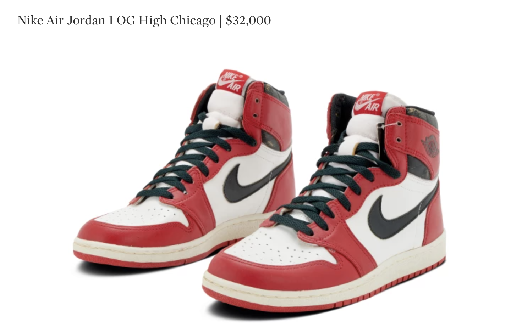
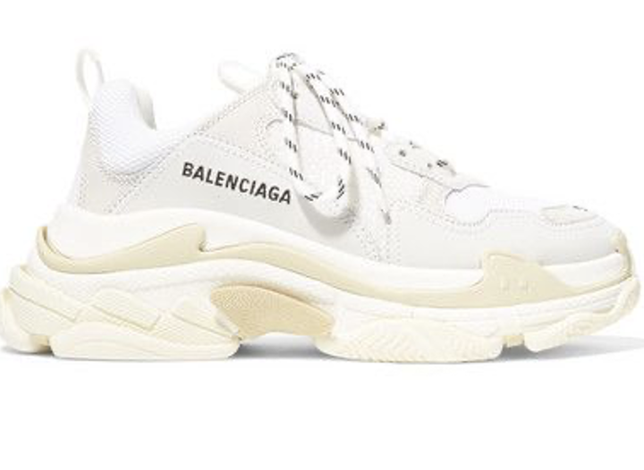
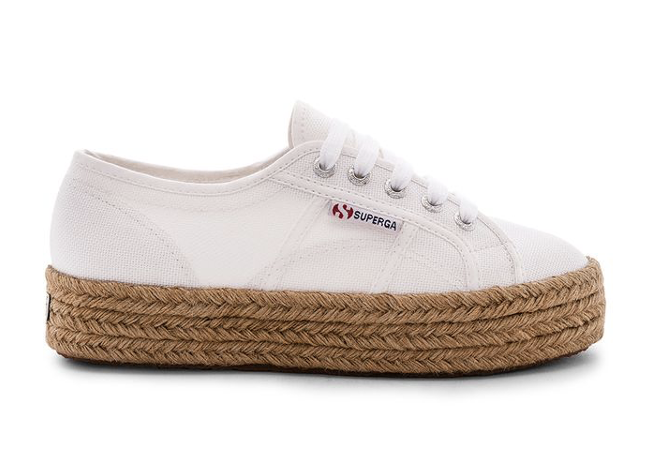
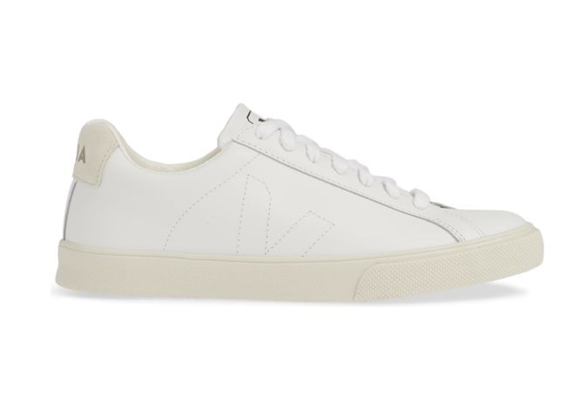
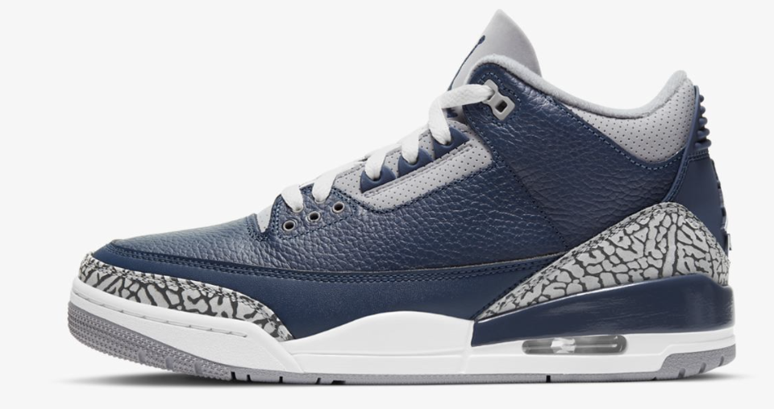

📗 Class 40. Entrepreneurship

*Conduct survey*  
*Report the results of the survey*

## Mixed grammar forms and tenses revision
> [!NOTE]  
> *Open the brackets with the correct form of the verb in brackets. (Present Future and Past forms)*  

1). The opera `starts` (start) at 7 pm. Could you be quick!  
2). Tuesday’s a very busy day. Some colleagues from the branch in Berlin `are coming` (come) over for a visit, so I `am going to be` (be) busy the whole day.  
3). Everything depends on this deal. But what `will you do` (you / do) if you `don't close` (not close) it? You must have a backup plan.  
4). I’m so happy that the office `has been redecorated` (redecorate). I just couldn't stand `working` (work) surrounded by those ugly greenish walls.  
5). I’ve got really awesome plans for the next year. I `am going to read` (read) 50 books.  
6). My husband and I `have been going` (go) to the same hotel in Egypt every year since 2012.  
7). I `have been trying` (try) to find you all morning! Where `have you been` (you/be)?  
8). My stepsister `moved` (move) to Japan in September. She `has chanbed` (change) three jobs since then, but she `hasn't found` (find) a good apartment to live in yet.  
9). Oh, no. My door handle `has been broken` (break) again by these nasty kids.  
10). The duchess `stepped` (step) out of the bath and `slipped` (slip) on the bar of soap that her maid `had forgotten` (forget) to pick up.  

---

## Review. How much do you spend? 

---

## Task 1. Discuss
> [!NOTE]  
> *Look at the pictures and discuss.*  

• Would you pay this much for sneakers? Why or why not?  
• What do you think makes these sneakers so expensive?  

• What are your favourite sneakers?  
• Do you wear this type of shoes?  
• What type of sneakers do you prefer?  

---

## Task 2. Video
### 2A Lead-in   
> [!NOTE]  
> *Discuss these questions with your partner.*  

• How could someone turn collecting or selling sneakers into a business?  
• Do you know anything about the sneaker on the photo?  
• What company produces them?  

---

### 2B Video 

[The secret sneaker market — and why it matters | Josh Luber](https://youtu.be/q49LtMyXK7Q)

This is the Air Jordan 3 Black Cement.  
This might be the most important sneaker in history.  
First released in 1988, this is the shoe that started Nike marketing as we know it.  
This is the shoe that propelled[🌐](# "propel [пропе́лд] — штовхати вперед, приводити в рух 🌐 The boat was propelled by a small motor. 🛠️ verb (past tense)") the entire Air Jordan lineage[🌐](# "lineage [лі́нідж] — родовід, походження 🌐 He can trace his lineage back to the 17th century. 🛠️ noun"), and perhaps saved Nike.  
The Air Jordan 3 Black Cement did for sneakers what the iPhone did for phones.  
It's been re-released four times.  
Every celebrity's been seen wearing it.  
There's a site about what to wear with the Black Cement.  
It's been right under your nose for decades and you never looked down.  
And right about now, most of you are probably thinking, "Sneakers?"  
Yes. Yes, sneakers.  
Some extraordinary things about sneakers and data and Nike and how they're all related, possibly, to the future of all online commerce.  
In 2011, the last time the Jordan 3 Black Cement was released, at a retail[🌐](# "retail [рі́тейл] — роздрібна торгівля 🌐 He works in retail, selling electronics. 🛠️ noun, verb") of 160 dollars, it sold out globally in minutes.  
And that's because people were camped outside of sneaker stores for days before it went on sale.  
And just minutes after that, thousands of those pairs were on eBay for two and three times retail.  
In fact, there's over 1,000 pairs on eBay right now, four years later.  
But here's the thing: this happens every single Saturday.  
Every week there's another release or two or three, and every shoe has a story as rich and compelling as the Jordan 3 Black Cement.  
This is Nike building the marketplace for sneakerheads -- people who collect sneakers -- and my daughter.  
That's an "I love Dad" T-shirt.  
For the brands, sneakerheads[🌐](# "sneakerhead [сні́керхедз] — людина, яка колекціонує або захоплюється кросівками 🌐 Sneakerheads often camp outside stores for limited-edition releases. 🛠️ noun (plural)") are a very important demographic.  
These are the tastemakers; these are the Apple fanboys.  
Because who else is going to buy a pair of $8,000 Back to the Future sneakers?  
Yeah, 8,000 dollars.  
And while that's obviously[🌐](# "obviously [о́бвіслі] — очевидно, безумовно 🌐 Obviously, we need to start earlier next time. 🛠️ adverb") the anomaly, the resell sneaker market is definitely not.  
Thirty years in the making, what started as an underground culture of a few people who like sneakers just a bit too much -- Now we have sneaker addictions.  
In a market where in the past 12 months, there have been over nine million pairs of shoes resold in the United States alone, at a value of 1.2 billion dollars.  
And that's a conservative estimate -- I should know, I am a sneakerhead.  
This is my collection.  
In the pantheon of great collections, mine doesn't even register.  
I have about 250 pairs, but trust me, I am small-time.  
People have thousands.  
I'm a very typical 37-year-old sneakerhead.  
I grew up playing basketball when Michael Jordan played, I always wanted Air Jordans, my mother would never buy me Air Jordans, as soon as I got some money I bought Air Jordans -- literally, we all have the exact same story.  
But here's where mine diverged[🌐](# "diverge [дайве́рджд] — розійшлися, відхилилися 🌐 Their paths diverged after graduation. 🛠️ verb (past tense)").  
After starting three companies, I took a job as a strategy consultant, when I very quickly realized that I didn't know the first thing about data.  
But I learned, because I had to, and I liked it.  
So I thought, I wonder if I could get ahold[🌐](# "ahold [ехо́улд] — схопити, отримати доступ до чогось (переважно у фразах) 🌐 I finally got ahold of him after several tries. 🛠️ noun (informal)") of some sneaker data, just to play with for my own amusement[🌐](# "amusement [ем'ю́змент] — розвага, забава 🌐 The park offers rides and other amusements for kids. 🛠️ noun").  
The goal was to develop a price guide, a real data-driven view of the market.  
And four years later, we're analyzing over 25 million transactions, providing real-time analytics on thousands of sneakers. 
Now sneakerheads check prices while camping out for releases.  
Others have used the data to validate insurance claims[🌐](# "insurance claim [іншу́ренс клеймз] — страхові вимоги, позови 🌐 He filed several insurance claims after the accident. 🛠️ noun (plural)").  
And the top investment banks in the world now use resell data to analyze the retail footwear industry.  
And here's the best part: sneakerheads have sneaker portfolios.  
Sneakerheads can track the value of their collection over time, compare it to others, and have access to the same analytics you might for your online brokerage account.  
░ ░░ ░░░ ░░░░ ░░░░░ ░░░░░░ ░░░░░░░ ░░░░░░░░ ░░░░░░░░ ░░░░░░░░░ ░░░░░░░░░░ ░░░░░░░░░░░  
So sneakerhead Dan builds his collection and identifies which 352 are his.  
He can see it's worth 103,000 dollars -- frankly, a modest collection.  
At the asset level, he can see gain-loss by shoe.  
Here he's made over 600 dollars on one pair.  
I have one of those.  
So an unregulated 1.2 billion dollar industry that thrives as much on the street as it does online, and has spawned fundamental financial services for sneakers?  
At some point I asked myself what's really going on in the market, and two comparisons started to emerge.  
Are sneakers more like stocks or drugs?  
In fact, one guy emailed to say he thought his 15-year-old son was selling drugs and later found out he was selling sneakers.  
And now they use the data to do it together.  
And that's because sneakers are an investment opportunity where none other exists.  
And I don't just mean the kid selling sneakers instead of drugs.  
How about all kids?   
You have to be 18 to play the stock market.  
I sold chewing gum in sixth grade, Blow Pops in ninth grade and collected baseball cards through high school.  
The cards are long dead, and the candy market's usually quite local.  
For a lot of people, sneakers are a legal and accessible investment opportunity -- a democratized stock market, but also unregulated.  
Which is why the story you're probably most familiar with is people killing each other for sneakers.  
And while that definitely happens and is tragic, it's not nearly the epidemic some media would have you believe.  
In fact, it's a very small piece of a much bigger and better story.  
So sneakers have clear similarities to both the stock exchange and the illegal drug trade, but perhaps the most fundamental is the existence of a central actor.  
Someone is making the rules.   
In the case of sneakers, that someone is Nike.   
Let me walk you through some numbers.  
The resell market, we know, is $1.2 billion.  
Nike, including Jordan brand, accounts for 96 percent of all shoes sold on the secondary market.  
Just complete domination.  
Sneakerheads love Jordans.  
And profit on the secondary market is about a third.  
That means that sneakerheads made 380 million dollars selling Nikes last year.  
Let's jump to retail for a second.  
Skechers, earlier this year, became the number two footwear brand in the country, surpassing Adidas -- this was a big deal.  
And in the 12 months ending in June, Skechers's net income was 209 million dollars.  
That means that Nike's customers make almost twice as much profit as their closest competitor.  
That -- How is that even possible?  
The sneaker market is just supply and demand, but Nike's gotten very good at using supply -- limited sneakers -- and the distribution of those sneakers to their own benefit.  
So it's really just supply.  
Sneakerheads joke that as long as it's limited and Nike, they'll buy it.  
Shoes that sell for 8,000 dollars do so because they're very rare.  
It's no different than any other collectible market, only this isn't a market at all.  
It's a false construct created by Nike -- ingeniously created by Nike, in the most positive sense -- to sell more shoes.  
And in the process, it provided tens of thousands of people with life-long passions, myself included.  
If Nike wanted to kill the resell market, they could do so tomorrow, all they have to do is release more shoes.   
But we certainly don't want them to, nor is it in their best interest.  
That's because unlike Apple, who will sell an iPhone to anyone who wants one, Nike doesn't make their money by just selling $200 sneakers.  
They sell millions of shoes to millions of people for 60 dollars.  
And sneakerheads are the ones who drive the marketing and the hype and the PR and the brand cachet, and enable Nike to sell millions of $60 sneakers.  
It's marketing.  
It's marketing the likes of which has never been seen before -- this isn't in any textbook.  
For 15 years Nike has propped up an artificial commodities market, with a Facebook-level hyped IPO every single weekend.  
Drive by any Footlocker at 8am on a Saturday morning, and there will be a line down the street and around the block, and sometimes those kids have been waiting there all week.  
You know those crazy iPhone lines you see on the news every other year?  
Nike lines happen 104 times more often.  
So Nike sets the rules.  
And they do so by controlling supply and distribution.  
But once a pair leaves the retail channel, it's the Wild West.  
There are very few -- if any -- legal, unregulated markets of this size.  
So Nike is definitely not the stock exchange.  
In fact, there is no central exchange.  
By last count, there were 48 different online markets that I know of.  
Some are eBay clones, some are mobile markets, and then you have consignment shops and brick-and-mortar stores, and sneaker conventions, and reseller sites, and Facebook and Instagram and Twitter -- literally, anywhere sneakerheads come into contact with each other, shoes will be bought and sold.  
But that means no efficiencies, no transparency, sometimes not even authenticity.  
Can you imagine if that's how stocks were bought?  
What if the way to buy a share of Apple stock was to search over 100 places online and off, including every time you walk down the street just hoping to pass someone wearing some Apple stock?  
Never knowing who had the best price, or even if the stock you were looking at was real.   
That would surely make you say: [WTF?]  
Of course that's not how we buy stock.  
But what if that's not how we need to buy sneakers either?  
What if the inverse is true, and what if we could buy sneakers exactly the same way as we buy stock?  
And what if it wasn't just sneakers, but any similar product, like watches and handbags and women's shoes, and any collectible, any seasonal item and any markdown item?  
What if there was a stock market for commerce?  
A stock market of things.  
And not only could you buy in a much more educated and efficient manner, but you could engage in all the sophisticated financial transactions you can with the stock market.  
Shorts and options and futures and well, maybe you see where this is going.  
Maybe you want to invest in a stock market of things.  
Because if you had invested in a pair of Air Jordan 3 Black Cement in 2011, you could either be wearing them onstage, or have earned 162 percent on your money -- double the S&P and 20 percent more than Apple.  
And that's why we're talking about sneakers.  
Thank you.  

---

## Task 3. How good an entrepreneur[🌐](# "entrepreneur [онтрепрене́р] — підприємець 🌐 The entrepreneur started her own tech company. 🛠️ noun") are you?
> [!NOTE]  
> *Follow the [link](https://www.psychologytoday.com/intl/tests/career/entrepreneurship-test) and take the test.* 
Share the result with your partner. 

---

## Task 4. Characteristics of an entrepreneur 
> [!NOTE]  
> *• Which of the words in the cloud are new for you? Ask your parner to help you understand them.*  
> *• Which of the words in the cloud are essential for being a successful entrepreneur? Choose 3 and explain why.*  

• abilities  
• owner  
• innovation  
• venture[🌐](# "venture [ве́нчер] — підприємство, ризикована справа 🌐 They started a new business venture together. 🛠️ noun, verb")  
• business  
• team  
• money  
• leadership[🌐](# "leadership [лі́дершип] — лідерство, керівництво 🌐 Her leadership skills helped the team succeed. 🛠️ noun")  
• management  
• initiative  
• entrepreneur  
• manager  
• action  
• risk  
• solutions  
• responsibilities  
• innovation  
• enterprise  
• capital  
• successful

---

## Task 5. Survey
> [!NOTE]  
> *You're going to carry out a survey to find out more about people's attitude[🌐](# "attitude [е́титьюд] — ставлення, позиція 🌐 His positive attitude helped him overcome difficulties. 🛠️ noun") to business. Work in small groups/individually, look at the questions in the table and write down 3 more questions.*

---

# Home assignment

## Task 1
> [!NOTE]  
> *Complete the sentence with the phrases that might match the gaps.* 
`Most`   `said`   `class`   `Most of`   `Quite`   `invited`   `we asked`   `Three`   `a few`

• `Most` of the class `said` they preferred studying in the morning rather than the afternoon.  
• `Three` of the people we `invited` to the event thought it was well-organized.  
• Quite `a few` of the students we asked believed the new rule would improve their learning experience.  
• Hardly `any` of the group we asked believed online learning is easier than face-to-face classes.  
• `Most` of the participants we invited said that breaks between lessons should be longer.  
• `Quite` a few of those we invited believed that the course content was very interesting.  
• Most of the `class` said they would like to participate in another survey.  
• Hardly any of the people `we asked` believed that the lessons were too short.  

---

## Task 2
> [!NOTE]  
> *Imagine you asked 10 friends the question: "What’s the best way to learn English?"*  
>
> *Write a short paragraph to report their answers. Use at least 4 phrases from the list below:*  
>
> *Phrases to Use:*  
>• Most of the class said  
>• Three of the people we asked  
>• Quite a few of them  
>• believed  
>• Hardly any of them  
>
> **Example:** *Most of the people we asked said watching movies in English helps a lot.*  

> Most of the class said that watching English movies with subtitles is the best way to learn. Three of the people we asked believed that speaking with native speakers is the most effective method. Quite a few of them mentioned that reading books in English helps expand vocabulary. Hardly any of them thought that learning grammar rules alone is enough to become fluent.

---

## Task 3. Mixed Grammar Topics
> [!NOTE]  
> *Choose the correct option.*  

1). Last month, the suspect told the officer that she `✔️ wasn't` `hadn't been` anywhere near the crime scene.   
2). I’m sorry to inform you, sir, that your flight  `delayed` `✔️ has been delayed`  
3). `Netherlands` `✔️ The Netherlands` is a country in `✔️ Europe` `the Europe`. It borders  `the Germany` `✔️ Germany`  to the east and Belgium to the south. It is one of `most` `✔️ the most` densely populated countries.  
4). This is a huge secret! You `don’t have to` `✔️ mustn't` tell anyone!   
5). The stone on her engagement ring was huge. I  `✔️ had never seen` `never saw` anything like that before.  
6). I would like `✔️ to invite` `inviting` you to an interview with the CEO.  
7). But you must  `✔️ be` `to be` nice to your boss. If you `✔️ aren't` `don't`, we’ll end up totally broke.  
8). What country would you like `living` `✔️ to live` in when you get old?  
9). We `knew` `✔️ have known` each other since childhood.  
10). When `✔️ did she get divorced?` `has she got divorced?`   