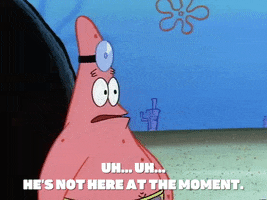

# Class 41. Bad manners and phones
*Talk about annoying habits connected to phones*

## Vocabulary review. Classes 25-27
[!NOTE]  
> *Fill in the gaps with missing words.*  
> *Then choose 3 phrases and ask your partner questions with those phrases.*  

1). get on `well`[🌍](# "get on well [ґет он вел] — добре ладнати, мати хороші стосунки")   
2). invite somebody `over`  
3). didn't do anything __  
4). get to `know` someone  
5). keep myself `to myself`  
6). rip-`off`[🌍](# "rip-off — грабіж, обман, занадто висока ціна")  
7). save a `buck`[🌍](# "Save a buck — заощадити гроші")  
8). it's not worth `buzz`  
9). __ to emails  
10). `remind` me about the dentist appointment  
11). `arrange` a meeting  
12). costs half as `much`  
13). it's `totally` overhyped  

---

## Task 1. Discuss
[!NOTE]  
> *Discuss together with your partner.*  

> 1). What type of phone do you have?       
> 2). How long have you had it?  
> 3). Would you like to get another phone? Why?  
> 4). What do you use your phone for (apart from talking)?  
> 5). When and were do you switch your phone off?  

---

## 📌 Task 2. Listening  
### 2A Listen and match
> [!NOTE]  
> *Listen and match what you hear to the sentences.*  

> 1). Speaker 1  
> c). He's just <ins>hung up[🌐](# "hang up [ханг ап] — покласти слухавку; зациклитися на чомусь 🌐 She hung up the phone angrily. 🛠️ phrasal verb")</ins>.  

> 2). Speaker 2  
> e). His phone <ins>went off[🌐](# "go off [вент оф] — вибухнути, спрацювати (сигналізація), зіпсуватися (про їжу) 🌐 The alarm went off at 6 a.m. 🛠️ phrasal verb")</ins> in the middle of the meeting.  

> 3). Speaker 3  
> j). The line's <ins>engaged[🌐](# "engage [інге́йджд] — зайнятий (лінія, людина); залучений 🌐 The phone line is engaged right now. 🛠️ adjective (past participle)")</ins>  

> 4). Speaker 4  
> b). She need to talk to the helpline but they've <ins>put her on hold[🌐](# "put (someone) on hold [пут хер он хоулд] — поставити когось на утримання (під час телефонної розмови) 🌐 The receptionist put her on hold while checking the schedule. 🛠️ phrasal verb")</ins>  

> 5). Speaker 5  
> h). She's <ins>left a message[🌐](# "leave a message [лефт е ме́сідж] — залишити повідомлення 🌐 I left a message on her voicemail. 🛠️ verb phrase")</ins> on his voicemail.  

> 6). Speaker 6  
> f). She's choosing a new <ins>ringtone[🌐](# "ringtone [рінґто́ун] — рінгтон, мелодія дзвінка 🌐 I changed my phone’s ringtone yesterday. 🛠️ noun").</ins>  

> 7). Speaker 7  
> d). He's <ins>dialing a number[🌐](# "dial a number [да́йлінґ е намбер] — набирати номер 🌐 She was dialing a number when the phone slipped from her hand. 🛠️ verb phrase").</ins>   

> 8). Speaker 8  
> a). He was <ins>cut off[🌐](# "cut off [кат оф] — обірватися (про зв'язок), відрізати, припинити 🌐 We were cut off in the middle of the call. 🛠️ phrasal verb")</ins> in the middle of the conversation.  

> 9). Speaker 9  
> k). He's <ins>calling back[🌐](# "call back [ко́лінґ бек] — передзвонювати 🌐 I’m calling back to confirm the appointment. 🛠️ phrasal verb").</ins>  

> 10). Speaker 10  
> i). She's <ins>texting[🌐](# "text [текстінґ] — надсилання текстових повідомлень 🌐 She was texting her friend during the break. 🛠️ verb (present participle)")</ins> a friend.  

> 11). Speaker 11  
> g). She's <ins>swiping through[🌐](# "swipe through [сва́йпінґ θру] — гортати, перегортати (наприклад, на телефоні) 🌐 I was swiping through photos on my phone. 🛠️ phrasal verb")</ins> photos.  

---

### 2B Translation
> [!NOTE]  
> *Translate into English. Correct answers are NOT given.* 

1). Він щойно поклав слухавку після довгої розмови зі своїм начальником.  
> He has just hung up after a long conversation with his boss.  

2). Його телефон задзвонив під час наради, і всі на нього подивилися.  
> His phone rang during the meeting, and everyone looked at him.  

3). Я намагався їй додзвонитися, але лінія постійно зайнята  
> I tried to call her, but the line was constantly busy.  

4). Вона залишила повідомлення на його голосовій пошті, попросивши передзвонити  
> She left a message on his voicemail asking him to call back.  

5). Вона обирає новий рінгтон для телефону й ніяк не може визначитися  
> She is choosing a new ringtone for her phone and can’t decide.  

6). Він набирає номер, але весь час помиляється, бо нервує  
> He is dialing the number but keeps getting it wrong because he’s nervous.  

7). Його роз’єднало посеред розмови, бо розрядився телефон.  
> He was cut off in the middle of the conversation because his phone ran out of battery.  

---

### 2C
> [!NOTE]  
> *Discuss with your group.*

1). Di you remember the last time you were cut off?  
2). Has you r phone ever gone off at a bad moment? (at a meeting, in the c inema etc)  
3). How often do you leave voicemessages?  
4). What phone network do you use? Are you happy with them?  
5). Have you ever sent a text message to the wrong person?  
6). Do you have a monthly contract or you "pay as you go"?  
7). How often do you swipe through other peoples' photos on social media?  
8). What do you do if you're put on hold for a long time?  

---

## Task 3. Reading
> [!NOTE]  
> *Read about the following situation. Was the conductor right? What else could have been done in that situation?*  

Conductor throws out audience member whose phone went off

At the national Music Auditorium in Madrid, Wednesday's performance on Hadnel's Messiah was interrupted by a mobile phone going off in a row close to the stage, during the aria He was despised. Conductor William Chrstie stopped the performance, turned, pointed at the phone owner, and shouted, "Out! You have just ruined one of the most beautiful passages of one of the most beautiful works ever written." The phone owner got up and quickly left the hall.

---

## Task 4 Opinions
> [!NOTE]  
> *Do you agree or disagree with the opinions?* 

Opinion 1.  
I think all concert halls should block mobile phone reception. Reception should be available until right before the concert begins, during the interval and immediately after it finishes.  

Opinion 2.  
I think the conductor did the right thing. People come to concerts to enjoy the music and have a special experience, not to be distracted by someone's phone. It's a matter of respect for the performers and the audience. If you can't follow basic rules, you shouldn't stay.  

Opinion 3.  
While I understand the conductor's frustration, it might have been a bit harsh to stop the performance and call the person out in front of everyone. Mistakes happen, and some people genuinely forget to silence their phones. Maybe a polite reminder at the beginning of the concert would help prevent such situations.  

Opinion 4.  
Honestly, the conductor overreacted. The person probably felt embarrassed enough without being singled out in front of everyone. A short pause and a general reminder to silence phones would have been enough. Public shaming seems unnecessary in this case.  

---

## Task 5.
> [!NOTE]  
> *Look at the photos and read the text.*

Discuss:  
a). Do you know people who do it? Do you ever do it?  
b). Does it annoy you or do you think it’s ok?  

13 annoying things people do with their phones

• take selfies all the time and post them online  
• talk loudly on their phones on public transport  
• put their phones on the table in front of them in a restaurant, in a cafe, or in your house  
• play noisy games on their phones  
• send or receive messages in the cinema  
• text while they're doing other things, e.g. talking to someone else, or walking in the street  
• tweet about everything, from what they had for breakfast to what time they went to bed  
• keep posting photos of their babies and small children  
• listen to music with headphones, but with the volume so loud that other people can hear it  
• take photos of everything they eat  
• video or photograph ever single event they go to and every minute of their holiday  
• post a message to you on your birthday, but never get in touch during the rest of the year  
• swipe through all your other photos when you are showing them just one  

---

## Task 6. Good manners. Speaking 

1). What are some manners in your country that no longer exist?  
2). What manners are found only in your country?  
3). Whose responsibility is it to teach children to be polite?  
4). Can someone's politeness show their social level or wealth?  
5). What culture do you think is the most polite? Explain.  
6). What advice would you give a foreigner visiting your country who would like ot show good manners?  
7). What is good etiquette when visiting someone's home? How would you try to be a good visitor?  
8). Do you say "hi" to people even if they are strangers? Why? Why not?  
9). What are some examples of impolite behavior that you have noticed?  
10). Do you think it is good manners to hug or kiss another person in greeting?  
11). Do you think staring at somebody that looks totally different from you is good manners? Why do you think people stare?  
12). Do people have more manners now or in earlier times?  
13). Do you listen to other's people conversations on the street?  
14). What are some bad table manners?  
15). What are some bad party manners?  
16). Is kissing in public good manners?  

---

## Flexi task. Video
> [!NOTE]  
> *Watch the scene  From the movie "Mrs Doubtfire" where Daniel (the main character)  prank calls his ex-wife. List and discuss examples of bad telephone manners displayed by Daniel in each prank call. Discuss them with your partner.*

Examples to look for:  
• Using an inappropriate tone or voice.  
• Not introducing himself properly.  
• Giving misleading or confusing information.  

[Mrs. Doubtfire Phone Call Interviews](https://youtu.be/2bttZmCyvmI)

---

# 📕 Home assignment 41

## Task 1
> [!NOTE]  
> *Complete the dialogue with the missing phrases.*  

`A`: "Hey, did you manage to call James about the party arrangements?"  
`B`: "I tried, but his line was `engaged` every time I called."  
`A`: "Oh, that’s frustrating! What did you do?"  
`B`: "Well, after a few attempts, I finally got through, but then we got `cut off` in the middle of the conversation. I think his phone `lost` signal."  
`A`: "Ugh, that’s annoying. Did you try again?"  
`B`: "Yeah, I called `back` right away, but he didn’t answer. So I `left a message` on his voicemail, explaining everything about the party."  
`A`: "That’s good. Did he respond yet?"  
`B`: "Not yet. But you know what’s worse? My phone `went off` in the middle of the meeting earlier today! I was so embarrassed."  
`A`: "Oh no! Didn’t you put it `on` silent?"  
`B`: "I thought I did, but I forgot to double-check. And now I’m thinking of choosing a new `ringtone` —something less embarrassing if it happens again."  

---

## Task 2.
> [!NOTE]  
> *Name the GIFs.*

  
Talking on the phone  

  
Phone vibrating  

  
Texting fast  

  
Dialing a number on an old phone  

  
Swiping through a dating app  

  
He's not here at the moment  

---

## Task 3 Mixed forms grammar revision
> [!NOTE]  
> *Choose the correct option.*  

1). I want ____ lunch for me.  
a). `you to order`  
b). order you  
c). to you order  

2). You’re running late again – second time this week. The boss ____ it!  
a). `is not going to like`  
b). will not like it  
c). isn’t liking  

3). I promise you'll get ____ products than those ones.  
a). much effective  
b). `much more effective`  
c). much effectiver  

4). Back in the days, I ____ a really good dancer. Unfortunately, I can’t dance anymore.  
a). am  
b). have been  
c). `was`  

5). A new sports club ____ nearby. It is due to open next year.  
a). is building  
b). `is being built`  
c). is built  

6). I don’t mind ____ housework. It actually calms me down.  
a). `doing`  
b). do  
c). to do  

7). I’ll try to talk to Jimmy if I ____ him after school tomorrow.  
a). will see  
b). `see`  
c). saw  

8). He said ____ : “I envy you a lot”.  
a). me  
b). `to me`  
c). for me  

9). I ____ to answer all of them.  
a). `don't want you`  
b). not want you  
c). you not want  

10). It costs ____ other panini in Florence.  
a). as much  
b). more  
c). `twice as much as`  