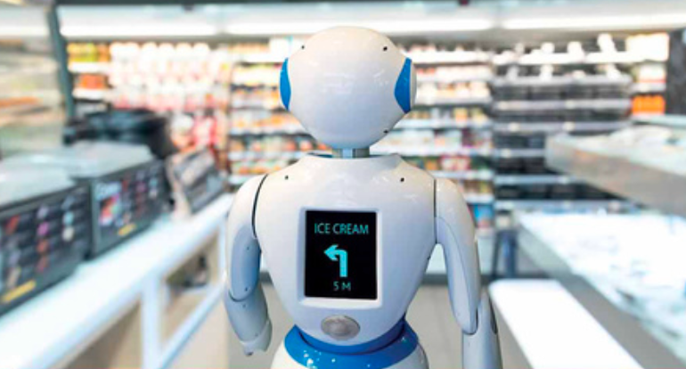

# Class 43. Writing as essay
*Write an opinion essay with supporting examples.*  

## Total review. Jeopardy game.
> [!NOTE]  
> *You're going to play a game of jeopardy. Decide on the number of teams.*  

Here is the link to the [game](https://jeopardylabs.com/play/2025-01-22-830)

---

## Task 1.
> [!NOTE]  
> *Match words with pictures.*  

  
social media  

  
robotics  

  
medicine  

---

## Task 2. Discuss
> [!NOTE]  
> *Answer the questions and note down the main ideas.* 

• What technological changes are happening in these three areas? Try to think of specific examples.  
• Which of these changes do you think are positive and which are negative?  

> There are major technological changes happening in the areas of social media, robotics, and medicine. In social media, artificial intelligence is increasingly used to personalize content. Short videos and live streaming are becoming more popular, and influencer marketing is growing rapidly. However, these changes also bring negative effects, such as privacy concerns, misinformation, and negative impacts on mental health.  
> In robotics, we see robots being used in manufacturing, delivery, agriculture, and even healthcare. Thanks to artificial intelligence, robots are becoming smarter and more capable — some, like Sophia, even look and act like humans. These changes are mostly positive because they improve efficiency and reduce risks for people.  
> In medicine, we see the rise of telemedicine, wearable health devices, and AI tools that help doctors diagnose illnesses more accurately. Robotic surgery and biotechnology are also advancing. These developments help detect diseases earlier and improve treatment, making the changes in medicine mostly positive.

---

## Task 3. Essay
> [!NOTE]  
> *Read the essay and answer the questions.*  

1). How far do you agree with the writer?  
2). How many of the changes that you thought of in the previous task  are mentioned in the essay?  
 
One of the areas of technology that is developing most quickly is robots. Robots are now able to do more things and can learn from experience. Some   people argue this offers enormous possibilities as robots are cheaper and   more reliable than humans. However, 
1). <ins>I would argue that the effects could be  very bad in terms of jobs and social relationships</ins>.  
2). <ins>While robots have been used in factories before, the number of different jobs that robots could soon do is huge</ins>. There are already driverless cars,
 which may replace taxis and lorries. Soon, there may also be robots for nursing and farming, robots working as shop   assistants  and even robots offering basic legal advice. One report has   suggested that 50 percent of all jobs will soon be lost in some countries.  
3). <ins>As well as the social problems caused by unemployment, greater use of robots damages social relationships in other ways</ins>. While having a robot nurse   may be cheap, it cannot chat or share emotions. There is plenty of evidence   that human contact improves our health and well-being. Robots could mean   humans have less contact with each other and start feeling lonely.  
4). <ins>In short, I think we should be very concerned about the use of robots</ins>. They will cause unemployment and could make people feel less connected to others.

---

## Task 4.

> [!NOTE]  
> *Read the essay again. Match underlined sentences with functions.*  

> 1). 3) As well as the social problems caused by unemployment, greater use of robots damages social relationships in other ways.  
> d). introduces the second main point  

> 2). 4) In short, I think we should be very concerned about the use of robots.  
> b). summarises and repeats the writer's main opinion  

> 3). 2) While robots have been used in factories before,  the number of different jobs that robots could soon do is huge.  
> a). introduces the first main point  

> 4). 1) I would argue that the effects could be very bad in terms of jobs and social relationships.  
> c). states the overall opinion of the writer  

---

## Supporting examples

**Using supporting examples**  
When writing an essay, it is usual to support opinions with examples. These   examples may be from your general knowledge and can include stories in the news, reports, statistics or quotes from experts. You can introduce these supporting examples with the phrase "**for example**", but often you don't use a linking word or phrase.  
• *The power of social media is growing all the time and many of the effects it has are positive. For example, people from anywhere can connect with anyone and share thoughts and feelings.*  

Task: Read the essay again. Underline an example that supports an opinion in each of paragraphs 1-3.

---

## Task 5. Essay 2
> [!NOTE]  
> *Read another essay on the same topic. Does the writer have the same opinion as the first writer?*  
> *Complete the essay with the examples a - f.  There is one extra example you do not need.*

Technology is progressing rapidly, especially robotics. Soon, many jobs could be replaced by robots and some argue it will result in a huge increase  in unemployment. 1) `f Some studies have suggested that 35-50 percent of current jobs are at risk.` However, I would argue that, firstly, the rise in unemployment is exaggerated and, secondly, robots are an opportunity for a better life.   

It is clear that robots will replace some jobs done by humans. However, based on what has happened in the past, unemployment on the whole will not increase. 2) `a For example, millions of farming jobs have gone, but general employment is now much higher.`  

New jobs are created to support new technology.  3) `e Thirty years ago, there were no website designers and fewer computer programmers.` Something similar will  probably happen in the case of robots.   

While it is possible that unemployment may increase, there are still things we   can do to reduce the effects and improve our lives. 4) `d We could reduce working hours and lower the age people retire, so that work is shared out more.`   

As a result, we may need more money to live, but we could raise this through taxes. 5) `c Bill Gates has suggested we could tax robots in the same way we tax workers.` Moreover, these changes could create more leisure time, which in  turn could create new jobs.  

In short, the impact of robots on unemployment will probably be smaller than   people think. Furthermore, if the money from taxes is used to pay for more research, robots will bring great benefits to everyone.

---

## Task 6. However and while  
> [!NOTE]  
> *Find and underline however and while in the essays. Then complete the definitions with the two words.*  

> 1). Use______ when you are adding a new sentence or a comment that contains surprising information or that contrasts with what came before. If it begins a sentence, it is followed by a comma.  
> a). however  

> 2). Use_______ at the start of a clause that introduces information that contrasts with information in the main clause.  
> b). while  

---

## Task 7. Practice
> [!NOTE]  
> *Complete the sentences with however or while.*  

1). `While` some argue that the effects of advances in technology are all positive, it seems to me that there will clearly be a number of negative effects.  
2). I understand that the growing population is a concern. `However`, the negative effects are often exaggerated.  
3). Many internet companies are huge multinational organisations. `While` this gives them some power, it doesn't mean we have no control over them.  
4). Some diseases will no longer be aproblem for us, `however` new diseases will probably appear.  
5). In the future, more and more robots will be used in hospitals. `While` they may be useful, robots will not replace humans completely.  

---

# 📕 Home assignment 43

## Task 1. Essay
> [!NOTE]  
> *Choose the essay area you are going to write about. Suggested areas: medicine, social media, AI etc.* 

> • Do you feel generally positive or negative about it?  
> • Think of two main points ot support your opinion.  
> • Think of one example ot support each of those points.  
> • Think about how to structure your essay. Use the two essays in this lesson to help you  

> Is Social Media a Positive Development?
> 
> One of the most powerful and fast-changing areas of technology today is social media. While it has brought certain benefits, I would argue that the overall impact of social media is more negative than positive, especially in terms of mental health and misinformation.
> 
> Firstly, the increasing use of social media is affecting people’s mental well-being. Many users compare themselves to others online, which often leads to low self-esteem, anxiety, and even depression. For example, research by the Royal Society for Public Health in the UK found that Instagram was the platform most harmful to young people’s mental health, as it encouraged unrealistic body image expectations and cyberbullying.
> 
> Secondly, social media plays a huge role in spreading misinformation. Algorithms tend to show users content that confirms their existing beliefs, even if that content is false. For instance, during the COVID-19 pandemic, false claims about vaccines were shared widely on platforms like Facebook and Twitter, making it harder for people to trust reliable health advice.
> 
> In short, while social media allows people to stay connected and express themselves, it also causes serious problems. Its negative effects on mental health and its role in spreading false information are reasons why we should be cautious about how we use it.