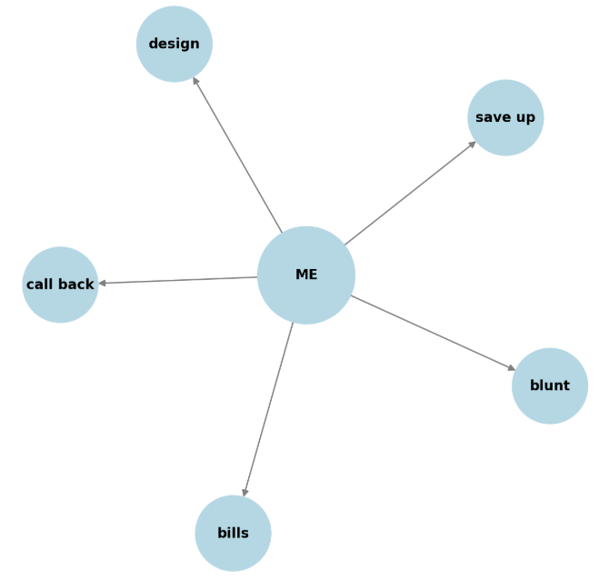

# Class 44. Revision 4
*Revise classes 34-43* 

## Task 1. Grammar rules
> [!NOTE]
> *Complete the gaps in the table.* 

| Topic | Rule/Structure | Example |
|---|---|---|
| Zero Conditional |If + `Present Simple`, Present Simple   Used for general truths or facts that are always true . | *If you `heat` water to 100°C, it boils.*   *If it rains, the grass gets wet.*|
| First Conditional | If + `Present Simple`, will + Base Verb   Used for real or likely situations in the future. | *If you study hard, you will pass the test.*   If it gets cold, we will stay indoors. |
| Second Conditional | If + `Past Simple`, `would` + Base Verb   Used for unreal or hypothetical situations in the present or future. | If I won the lottery, I would travel the world.   If I were you, I would take that job. |
| Third Conditional | If + `Past Perfect`, would have + Past Participle   Used for unreal situations in the past (hypothetical, regrets). | *If you `had studied` harder, you would have passed the exam.*   *If they had left earlier, they wouldn’t have missed the train.* |
| Modals of Deduction (Present) | Must (certainty), May/Might/Could (possibility), Can’t (impossibility) | He must be at home because the lights are on. |

---

## Task 2. Conditionals. Speaking 

[All Conditionals](https://wordwall.net/resource/25618558/all-conditionals)  

---

# Task 3. Modals of deduction (present) 

The task is [here](https://learningapps.org/view3057700?&allowFullscreen=1)

---

## FLEXI task
> [!NOTE]  
> *You are going to read 3 crime scenarious. Discuss with your partner who commited each crime. Why? Use modals of deduction: can't, might, must, may* 

**The Missing Phone**

Last night, during a birthday party at a friend's house, Emma's phone went missing. She had placed it on the kitchen table while she helped set up the decorations. When the party was in full swing, Emma realized her phone was gone. Three people were near the table around that time: Lucy, who was taking photos for Instagram; Jake, who was seen holding a similar phone earlier; and Mia, who quickly left the kitchen to answer a call. Who took Emma’s phone?

**The Broken Window**

On Saturday afternoon, a neighbor called the police to report a broken window at Mrs. Brown’s house. When Mrs. Brown arrived home, she found the window smashed and a soccer ball inside her living room. Outside, three children were playing: Alex, who said he was playing far from the house; Ben, who admitted he kicked the ball hard but claimed it wasn’t him; and Clara, who quickly left when the police arrived. Who broke the window?

**The Missing Necklace**

During a family dinner at a fancy restaurant, Aunt Clara noticed that her diamond necklace was missing. She remembered wearing it when they arrived, but it disappeared sometime during the evening. Three people were near her table: the waiter, who was very attentive and kept coming back to check on the table; her cousin Ella, who complimented the necklace earlier and asked to try it on; and her little nephew Tommy, who was playing under the table. Who took the necklace?

---

## Task 4. Talk about me
> [!NOTE]  
> *Step 1. You'll see a diagram with some information about your teacher. Guess what the words in circles mean by asking your teacher questions. You are only allowed to ask 7 questions.*  
> *Step 2. Create similar diagrams about you. You may use more cicles. Use the vocabulary provided.*  
> *Step 3. Tell your partner the words in your diagram. Let him/her ask you questions to guess what the words in circles mean.*  

**Vocabulary to use:**
clever
creative
peculiar
observant
self-assured
swipe through
hang up
leave a voice message
budget for
set a budget
afford
save up
open up
investment account
mortgage
rent
bills
gold medals
defend
women's right
victory
widely read
painter
athlete
philosopher
explorer
poet
architect
reach out
make excuses
drift apart
go through a really tough patch
be my guest

> ...